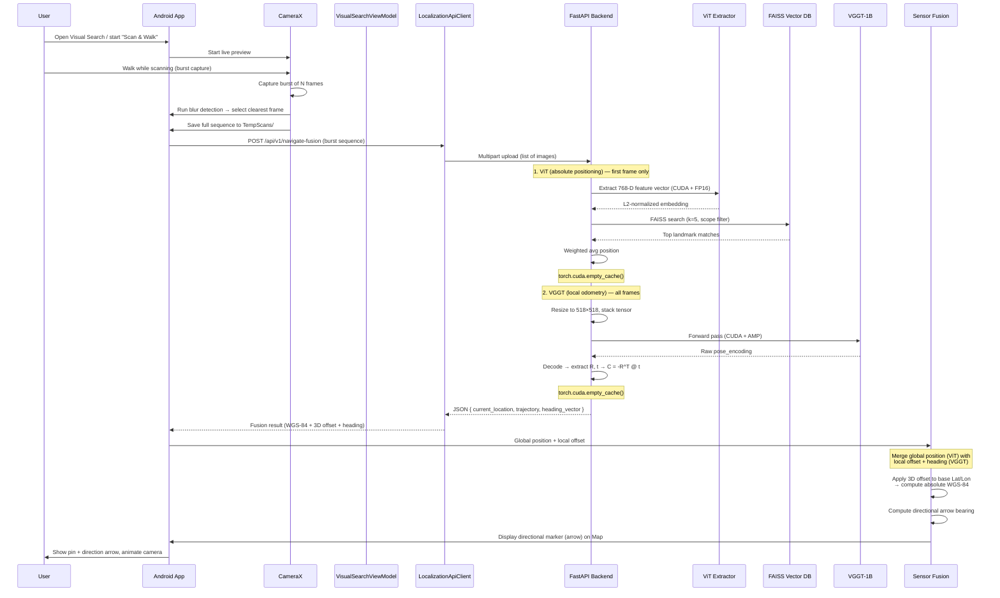

# NaviSense — Project Architecture

## Project Overview

**NaviSense** is a mobile application for GPS-free navigation that uses **Visual Place Recognition (VPR)** and **Visual Odometry** to estimate a user's geographic position. The system is designed primarily for couriers and delivery personnel operating in dense urban environments where GPS signals may be unreliable or unavailable.

The core value proposition is simple: **point your phone's camera at your surroundings, and NaviSense tells you where you are** — no GPS required. The app captures a photo, sends it to the ML backend, which uses a Vision Transformer (ViT) to match it against a database of geo-tagged reference images (global positioning), while VGGT computes local 3D camera offset from image sequences (local odometry). The result is a precise WGS-84 coordinate returned to the map interface.

The project is split into two major components:

- **`backend/`** — Python/FastAPI server running PyTorch-based ML models (DINOv2, ViT, VGGT) with **NVIDIA GPU (CUDA) acceleration**
- **`mobile/`** — Kotlin/Android app with CameraX, Google Maps SDK, Room database, and Retrofit networking

---

## Tech Stack

### Backend (Python)

| Technology | Purpose |
|---|---|
| [`FastAPI`](backend/requirements.txt:1) | REST API framework with automatic OpenAPI docs |
| [`Uvicorn`](backend/requirements.txt:2) | ASGI server |
| [`PyTorch`](backend/requirements.txt:3) | Deep learning framework (CUDA-enabled) |
| [`Transformers`](backend/requirements.txt:4) (HuggingFace) | Model loading (DINOv2, ViT) |
| [`FAISS`](backend/requirements.txt:5) (cpu/gpu) | Vector similarity search over landmark embeddings |
| [`Pillow`](backend/requirements.txt:6) | Image loading and preprocessing |
| [`NumPy`](backend/requirements.txt:7) | Numerical operations |
| [`SciPy`](backend/requirements.txt:11) | Scientific computing utilities |
| [`Docker`](backend/Dockerfile:1) | Containerized deployment (Python 3.10-slim) |

#### GPU Accelerations

All three ML models leverage **NVIDIA CUDA** when available, with significant optimisations for ultra-low latency:

| Optimisation | Scope | Details |
|---|---|---|
| **CUDA auto-detection** | `FeatureExtractor`, `VGGTProcessor`, `VectorDatabase` | Model device auto-selected (`cuda` if available, else `cpu`); FAISS index transparently moved to GPU via `faiss.index_cpu_to_gpu()` |
| **FP16 (Half Precision)** | [`FeatureExtractor.__init__()`](backend/app/feature_extractor.py:74), [`VGGT endpoint`](backend/app/main.py:296) | Models cast to `.half()` on GPU for 2× faster inference on Tensor Cores; input tensors also cast to FP16 before forward pass |
| **`@torch.inference_mode()`** | [`FeatureExtractor.extract_features()`](backend/app/feature_extractor.py:90) | Faster than `torch.no_grad()` — disables gradient tracking AND ops-specific inference hooks; used for all ViT/DINOv2 forward passes |
| **`torch.cuda.amp.autocast()`** | [`VGGTProcessor.get_relative_position()`](backend/app/vggt_processor.py:70) | Automatic Mixed Precision for the VGGT-1B forward pass; enables FP16 matrix multiplications while keeping critical ops in FP32 |
| **FAISS GPU with FP16** | [`VectorDatabase.__init__()`](backend/app/vector_db.py:36) | `faiss.GpuClonerOptions(useFloat16=True)` for 2× memory compression on GPU Tensor Cores; index transparently converted back to CPU before serialisation for portability |

### ML Models

| Model | Source | Dimension | Used By | Purpose | GPU Opt |
|---|---|---|---|---|---|
| **DINOv2** (ViT-B/14) | `facebook/dinov2-base` | 768-D | `POST /api/v1/position` | Feature extraction for landmark matching | CUDA + FP16 + `inference_mode()` |
| **ViT** (ViT-B/16) | `google/vit-base-patch16-224` | 768-D | `POST /api/visual-locate` | Visual Place Recognition with scope filtering | CUDA + FP16 + `inference_mode()` |
| **VGGT-1B** | `facebook/VGGT-1B` | N/A | `POST /api/v1/navigate-fusion` | 3D relative camera pose from image sequences | CUDA + `autocast()` FP16 |

### Frontend — Android (Kotlin)

| Library | Purpose |
|---|---|
| [`CameraX`](mobile/android/app/build.gradle.kts:137) (1.4.1) | Camera preview and single-frame capture with on-device blur detection |
| [`Retrofit 2`](mobile/android/app/build.gradle.kts:131) + OkHttp | HTTP client for backend API communication |
| [`Google Maps SDK`](mobile/android/app/build.gradle.kts:122) | Map display, markers, circles, polylines |
| [`Google Maps Services`](mobile/android/app/build.gradle.kts:120) | Directions API with waypoint optimisation + **Travel Modes** (Walking/Driving) |
| [`Room`](mobile/android/app/build.gradle.kts:146) (SQLite) | Local persistence (DeliveryHistory, SavedLocation) |
| [`Navigation Component`](mobile/android/app/build.gradle.kts:115) | Fragment navigation with bottom-nav |
| [`Coil`](mobile/android/app/build.gradle.kts:143) | Image loading |
| [`KSP`](mobile/android/app/build.gradle.kts:8) | Room annotation processing |
| `Material 3` | UI components (chips, bottom sheets, dialogs) |
| [`FusedLocationProviderClient`](mobile/android/app/src/main/java/com/navisense/ui/search/VisualSearchViewModel.kt:128) | Device GPS location |
| [`Geocoder`](mobile/android/app/src/main/java/com/navisense/ui/search/VisualSearchViewModel.kt:500) | Reverse geocoding (district/city/country resolution) + **forward geocoding** for arbitrary address search in route builder |
| [`Places API`](mobile/android/app/build.gradle.kts:120) | Address autocomplete and point-of-interest search for route waypoints |

---

## Architectural Rules & Mobile App Features

### Architectural Rules
* **Storage Strategy:** Images are NEVER stored as BLOBs in SQL/Room databases. Both frontend and backend save images to local disk folders (`TempScans/` for Android, `data/keyframes/` for Backend) and pass relative/absolute file paths to the ML processors or DB.
* **ML Pipeline Execution:** ViT and VGGT MUST be executed sequentially (ViT first, then VGGT) with `torch.cuda.empty_cache()` called in between. Never run heavy ML models concurrently to prevent CUDA Out-Of-Memory errors.
* **Graceful Degradation:** If FAISS, PyTorch, or CUDA fail to load, the backend must auto-fallback to Mock Classes without crashing the server.


### Mobile App Features (MVVM)
* **Map Screen (Home):** Google Map with search bar, fuzzy filtering, category chips, and radius circles.
* **Route Builder:** Polyline generation with Google Directions API (Walking/Driving modes), and a TSP (Travelling Salesperson) heuristic to optimize middle waypoints.
* **Analytics:** Custom Canvas-drawn charts (Pie, Bar, District Lollipop) showing visited vs. favorite locations.
* **Visual Search:** The trigger screen for the SLAM pipeline. Activates CameraX to capture the 4-frame burst sequence.

---

## Architecture Diagram / Data Flow

### Primary Flow: "Scan & Walk" — Burst Capture + Sensor Fusion



---

## Backend Structure

### Directory Layout

```text
backend/
├── Dockerfile                          # Container build
├── requirements.txt                    # Python dependencies
├── README.md                           # Backend documentation
├── data/
│   └── reference_images/              # Geo-tagged reference photos
│       ├── ref1.jpg
│       ├── ref2.jpg
│       └── metadata.json               # GPS coords + scopes per image
├── vector_index/                       # Pre-built FAISS index files
│   └── .gitkeep
└── app/
    ├── __init__.py
    ├── main.py                         # FastAPI app + all endpoints
    ├── feature_extractor.py            # DINOv2/ViT feature extraction (CUDA + FP16)
    ├── vector_db.py                    # FAISS vector database (GPU-capable)
    ├── init_vector_db.py              # CLI tool to build index from real metadata.json
    ├── vggt_processor.py              # VGGT-1B wrapper for 3D odometry (AMP)
    └── test_processor.py              # Test harness for VGGTProcessor
```

### API Endpoints

All endpoints defined in `backend/app/main.py`.

| Endpoint | Method | Input | Output | Description |
|---|---|---|---|---|
| `/` | GET | — | `{"message": "..."}` | Root welcome |
| `/api/v1/health` | GET | — | `{"status": "ok", "mode": "mock"\|"production"}` | Health check |
| `/api/v1/position` | POST | JPEG/PNG (multipart, max 5MB) | `{latitude, longitude, floor, confidence, nearest_landmarks[]}` | DINOv2-based position estimate |
| `/api/visual-locate` | POST | JPEG/PNG + `location_scope` form field | `{latitude, longitude, confidence_score}` | ViT-based VPR with optional scope filter |
| `/api/v1/navigate-fusion` | POST | **List of multipart images** (4 images) | `{current_location, trajectory, heading_vector}` | Sequential Fusion: ViT (absolute) then VGGT-1B (odometry) with `torch.cuda.empty_cache()` in between |
| `/api/v1/calibrate` | POST | JPEG/PNG | `{"message": "..."}` | Placeholder — not implemented |

#### `POST /api/v1/navigate-fusion` Details

Introduced to expose the `VGGTProcessor` and `ViT` as a single Fusion API endpoint. Accepts 4 images under the `files` multipart field. Processing pipeline:

1. **Validation** — at least 2 (recommended 4) non-empty images required.
2. **Sequential Execution** — ViT runs first (absolute positioning on frame 1), then `torch.cuda.empty_cache()`, then VGGT (odometry on all frames), then `torch.cuda.empty_cache()` again. Never parallel.
3. **Preprocessing** — each image resized to 518×518 (VGGT-1B native resolution), converted to `(1, N, 3, 518, 518)` tensor.
4. **GPU/FP16** — tensor moved to CUDA and cast to `.half()` when available.
5. **Inference** — `VGGTProcessor.get_full_odometry()` with AMP autocast.
6. **Decoding** — `pose_encoding_to_extri_intri()` → extract `R`, `t` of last frame.
7. **Camera centre** — `C = -R^T @ t` in world coordinates.

---

## Frontend Structure

### Directory Layout

```text
mobile/android/
├── build.gradle.kts                     # Top-level (AGP 8.2.2, Kotlin 1.9.22, KSP)
├── gradle.properties
├── local.properties                     # MAPS_API_KEY (gitignored)
├── app/
│   ├── build.gradle.kts                 # Module build (SDK 34, min 26)
│   ├── proguard-rules.pro
│   └── src/main/
│       ├── AndroidManifest.xml
│       ├── res/
│       │   ├── navigation/nav_graph.xml
│       │   ├── layout/                  # 6 fragment layouts + bottom sheet
│       │   ├── drawable/                # Icons (add, analytics, camera, etc.)
│       │   ├── values/strings.xml       # English
│       │   ├── values-uk/strings.xml    # Ukrainian
│       │   └── ...
│       └── java/com/navisense/
│           ├── NaviSenseApplication.kt
│           ├── MainActivity.kt
│           ├── core/
│           │   ├── NaviSenseApi.kt      # Retrofit interface
│           │   ├── LocalizationApiClient.kt  # HTTP client with retry logic
│           │   ├── FileManagerService.kt    # Temp file management
│           │   └── ScannerCamera.kt         # CameraX capture + blur detection
│           ├── data/
│           │   ├── LocationRepository.kt        # Repository interface
│           │   ├── RoomLocationRepositoryImpl.kt # Room-backed implementation
│           │   └── local/
│           │       ├── AppDatabase.kt           # Room DB (version 2)
│           │       ├── DeliveryHistory.kt       # Delivery log entity
│           │       ├── DeliveryHistoryDao.kt    # DAO with Flow queries
│           │       ├── SavedLocation.kt         # Saved favourite entity
│           │       └── SavedLocationDao.kt      # CRUD DAO
│           ├── model/
│           │   ├── AppLocation.kt               # Core data model (Parcelable)
│           │   ├── AppLocationCategory.kt       # Category enum + marker colors
│           │   └── NavMode.kt                   # SCANNER / DASHCAM
│           └── ui/
│               ├── MainViewModel.kt             # Shared ViewModel (filters, route, analytics)
│               ├── map/MapFragment.kt           # Google Maps + markers + filters
│               ├── search/
│               │   ├── VisualSearchFragment.kt  # Camera + gallery + API flow
│               │   └── VisualSearchViewModel.kt # Location confirmation state machine
│               ├── add/AddLocationFragment.kt
│               ├── route/RouteBuilderFragment.kt # Waypoint selection + Directions API
│               ├── details/LocationDetailsBottomSheet.kt
│               └── analytics/
│                   ├── AnalyticsFragment.kt
│                   ├── BarChartView.kt
│                   ├── PieChartView.kt
│                   └── DistrictBarChartView.kt
```

### Navigation Graph

Defined in `nav_graph.xml` with 5 destinations:

| Fragment | ID | Label |
|---|---|---|
| `MapFragment` | `mapFragment` | Map (Home — start destination) |
| `AddLocationFragment` | `addLocationFragment` | Add Location |
| `RouteBuilderFragment` | `routeBuilderFragment` | Routes |
| `VisualSearchFragment` | `visualSearchFragment` | Visual Search |
| `AnalyticsFragment` | `analyticsFragment` | Analytics |

### Core Android Components

#### `ScannerCamera`
CameraX wrapper with:
- Single-frame capture at 1080×1920 resolution.
- On-device blur detection via Laplacian variance (threshold: 100.0).
- Designed for **burst capture** workflows — 4 frames are independently validated and passed to the Fusion endpoint.

#### `FileManagerService`
Manages `TempScans/` directory with:
- Storage space check (min 50 MB free).
- Unique filename generation.
- Secure file deletion after API response.

#### `MainViewModel`
Shared ViewModel (scoped to Activity) managing:
- **Location filters**: category, search query, favorites, visited status, radius.
- **Route building**: waypoint selection, Google Directions API optimisation.
- **Analytics**: computed `AnalyticsData` from all locations.

---

## Current State & Known Blockers

### ✅ Status: Done
* **Android Client:** Fixed `Not enough information to infer type variable T` in ViewModels.
* **API Optimization:** Replaced multiple endpoints with a single `/api/v1/navigate-fusion` endpoint. Android now sends 4 photos only 1 time.
* **Environment:** Successfully migrated to Python 3.12 `venv`, resolved C-extension conflicts, forced `numpy < 2` for VGGT compatibility.
* **HTTP 500 Error on Fusion Endpoint (Fix Applied):** The `NoneType` crash on `/api/v1/navigate-fusion` has been resolved by isolating the VGGT-1B import from the FAISS-dependent imports in `main.py`.
* **CUDA OOM on Fusion Endpoint (Fix Applied):** The *RuntimeError: CUDA out of memory* caused by `asyncio.gather()` running ViT and VGGT-1B concurrently on the GPU has been resolved. Both models now execute **sequentially** (ViT first, then `torch.cuda.empty_cache()`, then VGGT, then `torch.cuda.empty_cache()` again). The architectural rule in `.clinerules` and `PROJECT_ARCHITECTURE.md` has been updated to mandate sequential ML pipeline execution.

### 🔧 Fix Details: Mock Isolation in `main.py`

**Root Cause:** The three imports (`feature_extractor`, `vector_db`, `VGGTProcessor`) were grouped in a single `try/except` block. When FAISS failed to load on Windows (`DLL load failed while importing _swigfaiss`), the `except` handler caught the `ImportError` and set `VGGTProcessor = None`, even though VGGT has **no dependency** on FAISS whatsoever.

**Solution applied:**
1. **Separated imports** — VGGT-1B is imported first in its own `try/except` block (tracked via `_VGGT_AVAILABLE` flag). FAISS-dependent imports (`feature_extractor`, `vector_db`) remain in a separate block that triggers `USE_MOCK = True` on failure.
2. **Added `MockVGGTProcessor`** — When `_VGGT_AVAILABLE` is `False`, a fallback mock class is defined that returns plausible zero-ish odometry values. An alias `VGGTProcessor` is set to this mock, so `get_vggt_processor()` always returns a valid callable type.
3. **`get_vggt_processor()` untouched** — The function still lazy-instantiates via `VGGTProcessor()`, which now points to either the real model or the mock.

**Result:** The server starts and serves `/api/v1/navigate-fusion` without crashing, even when FAISS is completely broken on Windows. The ViT+FAISS endpoints gracefully fall back to mock data, while VGGT endpoints continue working (or return mock odometry data as well, if VGGT itself is unavailable).

### 🎯 Recommended: Fix FAISS on Windows
To restore full functionality (real FAISS vector search instead of mock random data), resolve the FAISS DLL error:

1. **Install Microsoft Visual C++ Redistributable:**
   - Download and install the latest VC++ Redistributable from Microsoft (both x64 and arm64).
   - FAISS's `_swigfaiss` DLL requires the VC++ runtime.

2. **Reinstall `faiss-cpu` with precompiled wheel:**
   ```bash
   pip uninstall faiss-cpu -y
   pip install faiss-cpu --only-binary=:all:
   ```
   This avoids building from source, which often fails on Windows without a full C++ toolchain.

3. **Or install via Conda (most reliable on Windows):**
   ```bash
   conda install -c pytorch faiss-cpu
   ```
   Conda handles DLL dependencies automatically.

4. **Verify the fix:**
   ```bash
   cd backend
   python -c "import faiss; print(faiss.IndexFlatL2(768))"
   ```
   If this prints an index object without a DLL error, FAISS is working.
