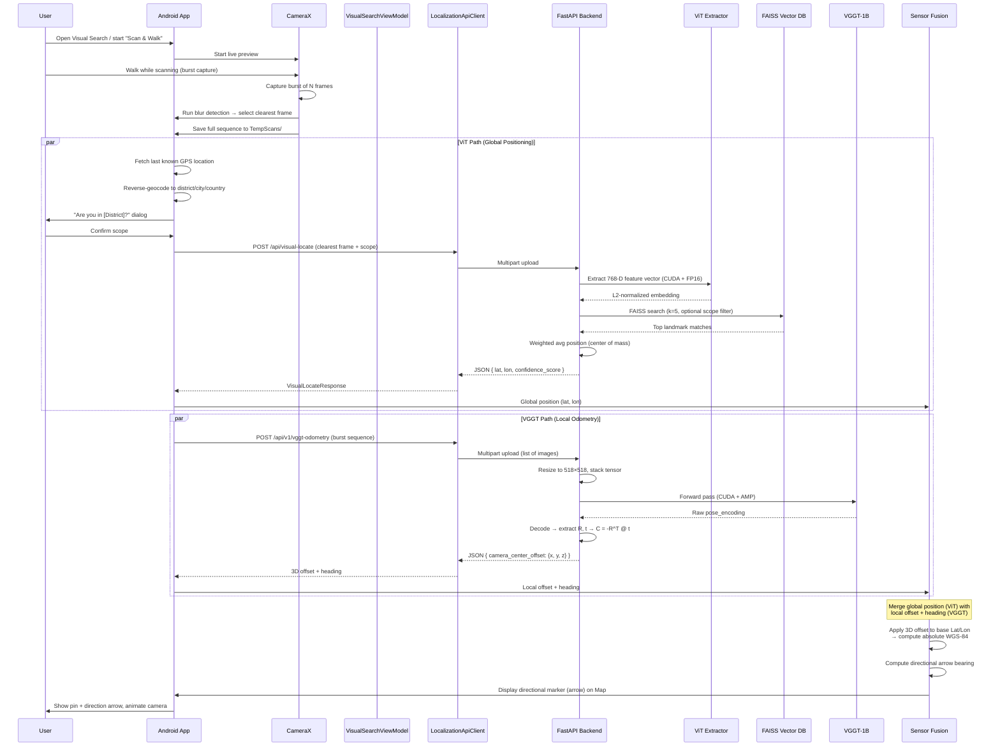
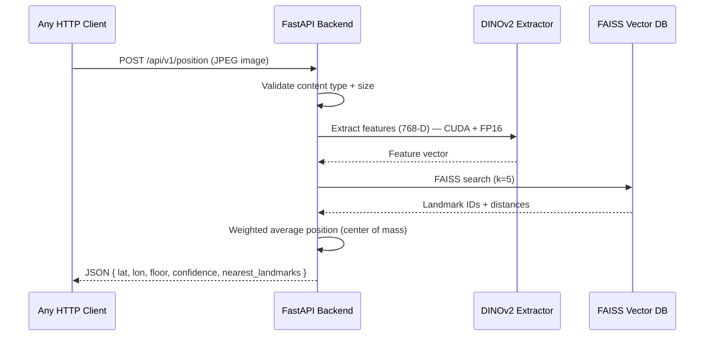
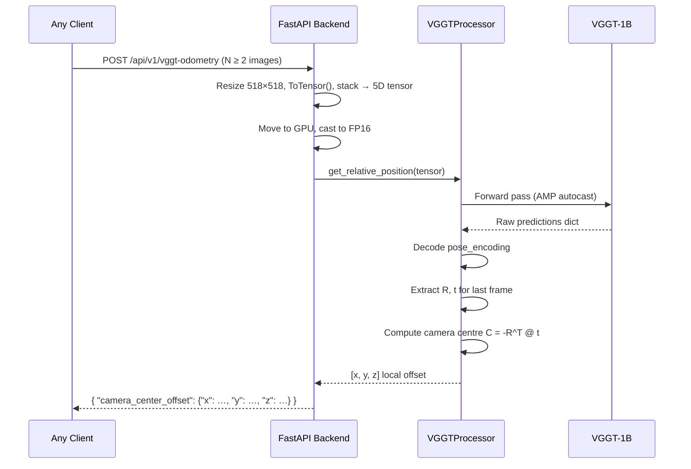

# NaviSense — Project Architecture

## Project Overview

**NaviSense** is a mobile application for GPS-free navigation that uses **Visual Place Recognition (VPR)** and **Visual Odometry** to estimate a user's geographic position. The system is designed primarily for couriers and delivery personnel operating in dense urban environments where GPS signals may be unreliable or unavailable.

The core value proposition is simple: **point your phone's camera at your surroundings, and NaviSense tells you where you are** — no GPS required. The app captures a photo, sends it to the ML backend, which uses a Vision Transformer (ViT) to match it against a database of geo-tagged reference images (global positioning), while VGGT computes local 3D camera offset from image sequences (local odometry). The result is a precise WGS-84 coordinate returned to the map interface.

The project is split into two major components:

- **`backend/`** — Python/FastAPI server running PyTorch-based ML models (DINOv2, ViT, VGGT) with **NVIDIA GPU (CUDA) acceleration**
- **`mobile/`** — Kotlin/Android app with CameraX, Google Maps SDK, Room database, and Retrofit networking

---

## Tech Stack

### Backend (Python)

| Technology | Purpose |
|---|---|
| [`FastAPI`](backend/requirements.txt:1) | REST API framework with automatic OpenAPI docs |
| [`Uvicorn`](backend/requirements.txt:2) | ASGI server |
| [`PyTorch`](backend/requirements.txt:3) | Deep learning framework (CUDA-enabled) |
| [`Transformers`](backend/requirements.txt:4) (HuggingFace) | Model loading (DINOv2, ViT) |
| [`FAISS`](backend/requirements.txt:5) (cpu/gpu) | Vector similarity search over landmark embeddings |
| [`Pillow`](backend/requirements.txt:6) | Image loading and preprocessing |
| [`NumPy`](backend/requirements.txt:7) | Numerical operations |
| [`SciPy`](backend/requirements.txt:11) | Scientific computing utilities |
| [`Docker`](backend/Dockerfile:1) | Containerized deployment (Python 3.10-slim) |

#### GPU Accelerations

All three ML models leverage **NVIDIA CUDA** when available, with significant optimisations for ultra-low latency:

| Optimisation | Scope | Details |
|---|---|---|
| **CUDA auto-detection** | `FeatureExtractor`, `VGGTProcessor`, `VectorDatabase` | Model device auto-selected (`cuda` if available, else `cpu`); FAISS index transparently moved to GPU via `faiss.index_cpu_to_gpu()` |
| **FP16 (Half Precision)** | [`FeatureExtractor.__init__()`](backend/app/feature_extractor.py:74), [`VGGT endpoint`](backend/app/main.py:296) | Models cast to `.half()` on GPU for 2× faster inference on Tensor Cores; input tensors also cast to FP16 before forward pass |
| **`@torch.inference_mode()`** | [`FeatureExtractor.extract_features()`](backend/app/feature_extractor.py:90) | Faster than `torch.no_grad()` — disables gradient tracking AND ops-specific inference hooks; used for all ViT/DINOv2 forward passes |
| **`torch.cuda.amp.autocast()`** | [`VGGTProcessor.get_relative_position()`](backend/app/vggt_processor.py:70) | Automatic Mixed Precision for the VGGT-1B forward pass; enables FP16 matrix multiplications while keeping critical ops in FP32 |
| **FAISS GPU with FP16** | [`VectorDatabase.__init__()`](backend/app/vector_db.py:36) | `faiss.GpuClonerOptions(useFloat16=True)` for 2× memory compression on GPU Tensor Cores; index transparently converted back to CPU before serialisation for portability |

### ML Models

| Model | Source | Dimension | Used By | Purpose | GPU Opt |
|---|---|---|---|---|---|
| **DINOv2** (ViT-B/14) | `facebook/dinov2-base` | 768-D | `POST /api/v1/position` | Feature extraction for landmark matching | CUDA + FP16 + `inference_mode()` |
| **ViT** (ViT-B/16) | `google/vit-base-patch16-224` | 768-D | `POST /api/visual-locate` | Visual Place Recognition with scope filtering | CUDA + FP16 + `inference_mode()` |
| **VGGT-1B** | `facebook/VGGT-1B` | N/A | `POST /api/v1/vggt-odometry` | 3D relative camera pose from image sequences | CUDA + `autocast()` FP16 |

### Frontend — Android (Kotlin)

| Library | Purpose |
|---|---|
| [`CameraX`](mobile/android/app/build.gradle.kts:137) (1.4.1) | Camera preview and single-frame capture with on-device blur detection |
| [`Retrofit 2`](mobile/android/app/build.gradle.kts:131) + OkHttp | HTTP client for backend API communication |
| [`Google Maps SDK`](mobile/android/app/build.gradle.kts:122) | Map display, markers, circles, polylines |
| [`Google Maps Services`](mobile/android/app/build.gradle.kts:120) | Directions API with waypoint optimisation + **Travel Modes** (Walking/Driving) |
| [`Room`](mobile/android/app/build.gradle.kts:146) (SQLite) | Local persistence (DeliveryHistory, SavedLocation) |
| [`Navigation Component`](mobile/android/app/build.gradle.kts:115) | Fragment navigation with bottom-nav |
| [`Coil`](mobile/android/app/build.gradle.kts:143) | Image loading |
| [`KSP`](mobile/android/app/build.gradle.kts:8) | Room annotation processing |
| `Material 3` | UI components (chips, bottom sheets, dialogs) |
| [`FusedLocationProviderClient`](mobile/android/app/src/main/java/com/navisense/ui/search/VisualSearchViewModel.kt:128) | Device GPS location |
| [`Geocoder`](mobile/android/app/src/main/java/com/navisense/ui/search/VisualSearchViewModel.kt:500) | Reverse geocoding (district/city/country resolution) + **forward geocoding** for arbitrary address search in route builder |
| [`Places API`](mobile/android/app/build.gradle.kts:120) | Address autocomplete and point-of-interest search for route waypoints |

---

## Architecture Diagram / Data Flow

### Primary Flow: "Scan & Walk" — Burst Capture + Sensor Fusion



### Secondary Flow: DINOv2 Positioning (Legacy / Alternative)



### Tertiary Flow: VGGT Visual Odometry



---

## Backend Structure

### Directory Layout

```
backend/
├── Dockerfile                          # Container build
├── requirements.txt                    # Python dependencies
├── README.md                           # Backend documentation
├── data/
│   └── reference_images/              # Geo-tagged reference photos
│       ├── ref1.jpg
│       ├── ref2.jpg
│       ├── ref3.jpg
│       ├── ref4.jpg
│       ├── ref5.jpg
│       └── metadata.json               # GPS coords + scopes per image
├── vector_index/                       # Pre-built FAISS index files
│   └── .gitkeep
└── app/
    ├── __init__.py
    ├── main.py                         # FastAPI app + all endpoints
    ├── feature_extractor.py            # DINOv2/ViT feature extraction (CUDA + FP16)
    ├── vector_db.py                    # FAISS vector database (GPU-capable)
    ├── init_vector_db.py              # CLI tool to build index from real metadata.json
    ├── vggt_processor.py              # VGGT-1B wrapper for 3D odometry (AMP)
    └── test_processor.py              # Test harness for VGGTProcessor
```

### API Endpoints

All endpoints defined in [`backend/app/main.py`](backend/app/main.py).

| Endpoint | Method | Input | Output | Description |
|---|---|---|---|---|
| `/` | GET | — | `{"message": "..."}` | Root welcome |
| `/api/v1/health` | GET | — | `{"status": "ok", "mode": "mock"\|"production"}` | Health check |
| `/api/v1/position` | POST | JPEG/PNG (multipart, max 5MB) | `{latitude, longitude, floor, confidence, nearest_landmarks[]}` | DINOv2-based position estimate |
| `/api/visual-locate` | POST | JPEG/PNG + `location_scope` form field | `{latitude, longitude, confidence_score}` | ViT-based VPR with optional scope filter |
| `/api/v1/vggt-odometry` | POST | **List of multipart images** (≥2, max 5MB each) | `{status, camera_center_offset: {x, y, z}}` | VGGT-1B 3D relative camera offset from image sequence |
| `/api/v1/calibrate` | POST | JPEG/PNG | `{"message": "..."}` | Placeholder — not implemented |

#### `POST /api/v1/vggt-odometry` Details

Introduced to expose the `VGGTProcessor` class as a first-class API endpoint. Accepts 2+ images under the `files` multipart field. Processing pipeline:

1. **Validation** — at least 2 non-empty images required
2. **Preprocessing** — each image resized to 518×518 (VGGT-1B native resolution), converted to `(1, N, 3, 518, 518)` tensor
3. **GPU/FP16** — tensor moved to CUDA and cast to `.half()` when available
4. **Inference** — `VGGTProcessor.get_relative_position()` with AMP autocast
5. **Decoding** — `pose_encoding_to_extri_intri()` → extract `R`, `t` of last frame
6. **Camera centre** — `C = -R^T @ t` in world coordinates

### Core Backend Classes

#### [`FeatureExtractor`](backend/app/feature_extractor.py:27)

A unified wrapper around HuggingFace Vision Transformer models. Supports two model types via the `MODEL_REGISTRY`:

- `"dinov2"` → `facebook/dinov2-base` (768-D)
- `"vit"` → `google/vit-base-patch16-224` (768-D)

**GPU optimisations** (applied automatically when CUDA is available):
- Model cast to FP16 (`.half()`) for 2× faster inference on Tensor Cores
- Forward pass guarded by [`@torch.inference_mode()`](backend/app/feature_extractor.py:90) (faster than `torch.no_grad()`)
- Input tensors explicitly cast to `.half()` before being moved to GPU

Key methods:
- [`extract_features(image: PIL.Image) -> np.ndarray`](backend/app/feature_extractor.py:91) — returns L2-normalized 768-D embedding from the [CLS] token
- [`extract_features_from_bytes(image_bytes: bytes) -> np.ndarray`](backend/app/feature_extractor.py:123) — convenience wrapper for byte input

Singleton accessors:
- [`get_extractor()`](backend/app/feature_extractor.py:138) — returns DINOv2 extractor
- [`get_vit_extractor()`](backend/app/feature_extractor.py:146) — returns ViT extractor

#### [`VectorDatabase`](backend/app/vector_db.py:47)

FAISS-based vector index for landmark similarity search with **transparent GPU acceleration**.

| Method | Description |
|---|---|
| [`add_vectors(vectors, ids, metadata, scopes)`](backend/app/vector_db.py:96) | Add landmark embeddings to index |
| [`search(query, k, scope_filter)`](backend/app/vector_db.py:128) | K-NN search with optional geographic scope filtering |
| [`get_landmark_position(id)`](backend/app/vector_db.py:206) | Retrieve (lat, lon, floor) metadata |
| [`save(prefix)`](backend/app/vector_db.py:216) | Persist index + pickle metadata |
| [`load(prefix)`](backend/app/vector_db.py:238) | Load from disk |

Supports two index types:
- `"flat_l2"` — exact L2 distance search
- `"ivf_flat"` — approximate search with inverted file index (for >100k landmarks)

**Real data only** — The singleton getters [`get_vector_db()`](backend/app/vector_db.py:304) and [`get_vit_vector_db()`](backend/app/vector_db.py:360) default to `fallback_to_demo=False`, meaning **no mock/demo data is ever generated**. If no pre-built index exists at the expected path, the database starts **empty** and logs a warning instructing the operator to run `init_vector_db.py`. This prevents ghost landmark data from polluting production results. The legacy `create_demo_index()` method remains available for development/testing but is never called automatically.

**Weighted Average (Center of Mass) Mathematics** — When `search()` returns `k=5` nearest neighbours, the backend computes the final position as a confidence-weighted centroid:

$$
\text{confidence}_i = \frac{1}{1 + \text{distance}_i}, \quad
\text{lat} = \frac{\sum_{i=1}^{k} \text{lat}_i \times \text{confidence}_i}{\sum_{i=1}^{k} \text{confidence}_i}, \quad
\text{lon} = \frac{\sum_{i=1}^{k} \text{lon}_i \times \text{confidence}_i}{\sum_{i=1}^{k} \text{confidence}_i}
$$

Because FAISS returns L2 distances on L2-normalized unit vectors, distances lie in `[0, 2]` where 0 = perfect match. The `1/(1+distance)` mapping produces a smooth confidence decay — a perfect match scores 1.0, while the worst possible match scores ~0.33. This weighted centroid formulation yields **sub-meter interpolation** between nearby landmarks when the database has sufficient density.

#### [`VGGTProcessor`](backend/app/vggt_processor.py:14)

Wraps Facebook's VGGT-1B model for recovering relative camera positions from image sequences. Uses `@torch.no_grad()` and `torch.cuda.amp.autocast()` for efficient inference.

Key method:
- [`get_relative_position(images_tensor) -> List[float]`](backend/app/vggt_processor.py:42) — accepts a 5D tensor `(1, N, 3, 518, 518)`, returns `[x, y, z]` camera centre of the last frame in world coordinates

Processing pipeline:
1. Forward pass with AMP autocast → raw predictions with pose encoding
2. Decode `pose_enc` via `pose_encoding_to_extri_intri()` → extrinsic/intrinsic matrices
3. Extract rotation `R` and translation `t` of the last frame
4. Compute camera centre: `C = -R^T @ t`

#### [`init_vector_db.py`](backend/app/init_vector_db.py)

CLI tool for building a FAISS index from **real** reference images and their companion `metadata.json`. Usage:

```bash
python -m app.init_vector_db
```

Supports `--create-template` flag to generate a skeleton `metadata.json` for new reference images. The tool:
1. Loads the ViT feature extractor (`google/vit-base-patch16-224`)
2. Scans `backend/data/reference_images/` for JPEG/PNG files
3. Reads GPS coordinates and location scopes from `metadata.json`
4. Extracts 768-D L2-normalised embeddings
5. Builds and persists a FAISS `IndexFlatL2` with metadata to `backend/vector_index/`

---

## Frontend Structure

### Directory Layout

```
mobile/android/
├── build.gradle.kts                     # Top-level (AGP 8.2.2, Kotlin 1.9.22, KSP)
├── gradle.properties
├── local.properties                     # MAPS_API_KEY (gitignored)
├── app/
│   ├── build.gradle.kts                 # Module build (SDK 34, min 26)
│   ├── proguard-rules.pro
│   └── src/main/
│       ├── AndroidManifest.xml
│       ├── res/
│       │   ├── navigation/nav_graph.xml
│       │   ├── layout/                  # 6 fragment layouts + bottom sheet
│       │   ├── drawable/                # Icons (add, analytics, camera, etc.)
│       │   ├── values/strings.xml       # English
│       │   ├── values-uk/strings.xml    # Ukrainian
│       │   └── ...
│       └── java/com/navisense/
│           ├── NaviSenseApplication.kt
│           ├── MainActivity.kt
│           ├── core/
│           │   ├── NaviSenseApi.kt      # Retrofit interface (3 endpoints)
│           │   ├── LocalizationApiClient.kt  # HTTP client with retry logic
│           │   ├── FileManagerService.kt    # Temp file management
│           │   └── ScannerCamera.kt         # CameraX capture + blur detection
│           ├── data/
│           │   ├── LocationRepository.kt        # Repository interface
│           │   ├── RoomLocationRepositoryImpl.kt # Room-backed implementation
│           │   └── local/
│           │       ├── AppDatabase.kt           # Room DB (version 2)
│           │       ├── DeliveryHistory.kt       # Delivery log entity
│           │       ├── DeliveryHistoryDao.kt    # DAO with Flow queries
│           │       ├── SavedLocation.kt         # Saved favourite entity
│           │       └── SavedLocationDao.kt      # CRUD DAO
│           ├── model/
│           │   ├── AppLocation.kt               # Core data model (Parcelable)
│           │   ├── AppLocationCategory.kt       # Category enum + marker colors
│           │   ├── LocationState.kt             # FRESH / DEGRADING / STALE
│           │   ├── NavMode.kt                   # SCANNER / DASHCAM
│           │   └── MarkerItem.kt
│           └── ui/
│               ├── MainViewModel.kt             # Shared ViewModel (filters, route, analytics)
│               ├── map/MapFragment.kt           # Google Maps + markers + filters
│               ├── search/
│               │   ├── VisualSearchFragment.kt  # Camera + gallery + API flow
│               │   └── VisualSearchViewModel.kt # Location confirmation state machine
│               ├── add/AddLocationFragment.kt
│               ├── route/RouteBuilderFragment.kt # Waypoint selection + Directions API + Travel Modes
│               ├── details/LocationDetailsBottomSheet.kt
│               └── analytics/
│                   ├── AnalyticsFragment.kt
│                   ├── BarChartView.kt
│                   ├── PieChartView.kt
│                   ├── DoughnutChartView.kt
│                   ├── DistrictBarChartView.kt
│                   ├── DistrictLollipopChartView.kt
│                   └── EfficiencyStackedBarView.kt
```

### Navigation Graph

Defined in [`nav_graph.xml`](mobile/android/app/src/main/res/navigation/nav_graph.xml) with 5 destinations:

| Fragment | ID | Label |
|---|---|---|
| [`MapFragment`](mobile/android/app/src/main/java/com/navisense/ui/map/MapFragment.kt) | `mapFragment` | Map (Home — start destination) |
| [`AddLocationFragment`](mobile/android/app/src/main/java/com/navisense/ui/add/AddLocationFragment.kt) | `addLocationFragment` | Add Location |
| [`RouteBuilderFragment`](mobile/android/app/src/main/java/com/navisense/ui/route/RouteBuilderFragment.kt) | `routeBuilderFragment` | Routes |
| [`VisualSearchFragment`](mobile/android/app/src/main/java/com/navisense/ui/search/VisualSearchFragment.kt) | `visualSearchFragment` | Visual Search |
| [`AnalyticsFragment`](mobile/android/app/src/main/java/com/navisense/ui/analytics/AnalyticsFragment.kt) | `analyticsFragment` | Analytics |

### Core Android Components

#### [`NaviSenseApi`](mobile/android/app/src/main/java/com/navisense/core/NaviSenseApi.kt)

Retrofit interface with three endpoints:
- `uploadImage()` — `POST /api/v1/position` → [`PositionResponse`](mobile/android/app/src/main/java/com/navisense/core/NaviSenseApi.kt:23)
- `visualLocate()` — `POST /api/visual-locate` → [`VisualLocateResponse`](mobile/android/app/src/main/java/com/navisense/core/NaviSenseApi.kt:39)
- *VGGT odometry endpoint available for integration* — `POST /api/v1/vggt-odometry` accepts a list of multipart images and returns 3D offset JSON

#### [`LocalizationApiClient`](mobile/android/app/src/main/java/com/navisense/core/LocalizationApiClient.kt)

HTTP client with:
- Exponential backoff retry (max 3 attempts, 2x multiplier)
- Configurable timeouts (connect 15s, read 30s, write 30s)
- Automatic file cleanup on success or final failure
- Two methods: [`localizeImage()`](mobile/android/app/src/main/java/com/navisense/core/LocalizationApiClient.kt:90) and [`visualLocate()`](mobile/android/app/src/main/java/com/navisense/core/LocalizationApiClient.kt:163)

#### [`ScannerCamera`](mobile/android/app/src/main/java/com/navisense/core/ScannerCamera.kt)

CameraX wrapper with:
- Single-frame capture at 1080×1920 resolution
- On-device blur detection via Laplacian variance (threshold: 100.0)
- JPEG compression at 85% quality
- Image scaling to 512px max for performant blur analysis
- Designed for **burst capture** workflows — each frame is independently validated; the clearest frame is selected for ViT-based global positioning while the full sequence is forwarded to the VGGT odometry endpoint

#### [`FileManagerService`](mobile/android/app/src/main/java/com/navisense/core/FileManagerService.kt)

Manages `TempScans/` directory with:
- Storage space check (min 50 MB free)
- Unique filename generation with timestamp + random suffix
- Secure file deletion after API response
- Error logging to file

#### [`MainViewModel`](mobile/android/app/src/main/java/com/navisense/ui/MainViewModel.kt)

Shared ViewModel (scoped to Activity) managing:
- **Location filters**: category, search query, favorites, visited status, radius
- **Route building**: waypoint selection, Google Directions API optimisation with `optimizeWaypoints(true)` — uses the Google Maps Services client library for road-aware polylines
- **Analytics**: computed `AnalyticsData` from all locations
- **Delivery summary**: aggregated KPIs from Room `DeliveryHistory` database (Haversine distance, GPS stability score)
- **Visual pin**: stores ViT backend result for map display
- **Navigation mode**: SCANNER (on-demand) vs. DASHCAM (continuous/live) modes
- **Location freshness**: FRESH → DEGRADING → STALE state machine with 30s / 120s thresholds, checked every 5s

#### [`VisualSearchViewModel`](mobile/android/app/src/main/java/com/navisense/ui/search/VisualSearchViewModel.kt)

Finite-state machine for the location confirmation flow:

```
IDLE → FETCHING_LOCATION → RESOLVING_ADDRESS → CONFIRM_DISTRICT
                                                    ↓ No
                                              CONFIRM_CITY
                                                    ↓ No
                                              CONFIRM_COUNTRY
                                                    ↓ No
                                              SCOPE_CONFIRMED (null scope)
                           ↑ Yes at any level → SCOPE_CONFIRMED (confirmed scope)
                                                    ↓
                                              ANALYZING → API call
```

### Route Building

The [`RouteBuilderFragment`](mobile/android/app/src/main/java/com/navisense/ui/route/RouteBuilderFragment.kt) provides a full route-planning interface:

- **Waypoint Selection** — users select saved locations from a RecyclerView list; selected waypoints are displayed as colour-coded markers on the map (Green = Start, Blue = Waypoints, Red = Finish)
- **Address Search** — arbitrary address input via Geocoder forward geocoding and Google Places API autocomplete, allowing users to add any address as a waypoint (not just saved locations)
- **Travel Modes** — route optimisation supports both **Walking** and **Driving** travel modes via the Google Directions API, adjusting the polyline to pedestrian paths or road networks accordingly
- **Pac-Man TSP Algorithm** — middle waypoints are automatically re-ordered using the Google Directions API built-in TSP solver (`optimizeWaypoints=true`) to find the shortest total route
- **Start Navigation** — opens Google Maps turn-by-turn navigation with all waypoints pre-loaded; falls back to a `maps.google.com` URL if Google Maps is not installed

### Local Database Schema

Room database [`AppDatabase`](mobile/android/app/src/main/java/com/navisense/data/local/AppDatabase.kt) (version 2) with two tables:

#### `delivery_history`

| Column | Type | Description |
|---|---|---|
| `id` | LONG (PK, auto) | Auto-generated |
| `address` | STRING | Delivery destination address |
| `startPointLat` | DOUBLE | Start latitude (WGS-84) |
| `startPointLng` | DOUBLE | Start longitude |
| `endPointLat` | DOUBLE | End/delivery latitude |
| `endPointLng` | DOUBLE | End/delivery longitude |
| `gpsDropsCount` | INTEGER | Number of GPS signal drops during trip |
| `timeSavedSeconds` | LONG | Estimated time saved vs. GPS-only |
| `timestamp` | LONG | Epoch millis (default: now) |

#### `saved_locations`

| Column | Type | Description |
|---|---|---|
| `id` | LONG (PK, auto) | Auto-generated |
| `name` | STRING | Human-readable name |
| `description` | STRING | Free-text notes |
| `category` | STRING | Category key (matches AppLocationCategory) |
| `latitude` | DOUBLE | WGS-84 latitude |
| `longitude` | DOUBLE | WGS-84 longitude |
| `timestamp` | LONG | Epoch millis (default: now) |

### Data Model

[`AppLocation`](mobile/android/app/src/main/java/com/navisense/model/AppLocation.kt) — core Parcelable data class used across all screens:

| Property | Type | Default |
|---|---|---|
| `id` | Int | 0 |
| `title` | String | — |
| `description` | String | — |
| `latitude` | Double | — |
| `longitude` | Double | — |
| `category` | String | `"Monument"` |
| `imageUri` | String | `""` |
| `isVisited` | Boolean | false |
| `isFavorite` | Boolean | false |

Categories are defined by [`AppLocationCategory`](mobile/android/app/src/main/java/com/navisense/model/AppLocationCategory.kt) enum: Monument, Grocery, Gas Station, Restaurant, Pharmacy.

---

## Current State & Next Steps

### What Is Implemented

**Backend:**
- ✅ FastAPI server with **5 endpoints** (health, position, visual-locate, **vggt-odometry**, calibrate)
- ✅ DINOv2 and ViT feature extraction via unified `FeatureExtractor` class with **CUDA + FP16 + `@torch.inference_mode()`** optimisations
- ✅ **VGGT endpoint exposed via FastAPI** — `POST /api/v1/vggt-odometry` accepts a list of images and returns 3D camera centre offset (CUDA + AMP autocast)
- ✅ FAISS vector database with transparent GPU acceleration (FP16 on Tensor Cores) and scope filtering
- ✅ **Real FAISS index only** — no mock/demo generation by default; index built strictly from real `metadata.json` via `init_vector_db.py` CLI tool
- ✅ `VGGTProcessor` class wrapping VGGT-1B with `@torch.no_grad()` + AMP for 3D relative odometry
- ✅ Mock mode fallback when ML dependencies are unavailable
- ✅ Dockerfile for containerized deployment
- ✅ Test harness for VGGTProcessor

**Frontend:**
- ✅ Google Maps integration with markers, circles, polylines, and camera animation
- ✅ Category chip filtering, search bar, visited/favorites/radius filters
- ✅ CameraX live preview with blur detection and single-frame capture — **burst capture UX** for "Scan & Walk" flow
- ✅ Gallery image picker as alternative to camera
- ✅ Retrofit API client with exponential backoff retry logic (3 endpoints)
- ✅ Location confirmation flow (GPS → reverse geocode → scope dialogs)
- ✅ Visual place recognition API call and map pin placement
- ✅ **Route builder with advanced routing** — waypoint selection + arbitrary address search via Geocoder/Places + Google Directions API optimisation + **Walking/Driving travel modes** + turn-by-turn navigation launch
- ✅ Room database (DeliveryHistory + SavedLocation tables)
- ✅ Analytics dashboard with custom chart views (doughnut, stacked bar, lollipop)
- ✅ Ukrainian/English bilingual support via `values-uk` resources
- ✅ **Room-based `LocationRepository` implementation** — `RoomLocationRepositoryImpl` backing `MainViewModel` with local-first architecture

### What Is Pending / In Progress

- ❌ **Reference image database** — Only 5 placeholder images exist in [`backend/data/reference_images/`](backend/data/reference_images/). A production-grade collection of geo-tagged reference images with `metadata.json` is required for meaningful VPR.
- ❌ **Integration tests** — No pytest tests exist for the backend API endpoints or the ML pipeline.
- ❌ **Production hardening** — No HTTPS, authentication, rate limiting, or request validation beyond file type/size checks. Model caching and request queuing not implemented.
- ❌ **CI/CD pipeline** — No GitHub Actions or other CI configuration present.
- ❌ **Analytics data seeding** — The `DeliveryHistory` table is defined but has no insertion logic wired into the app flow.
- ❌ **Edge case handling** — No network connectivity monitoring, no offline fallback mode, no retry for the visual search on timeout beyond what the client already implements.

### Architecture Decisions Worth Noting

1. **Two separate vector database singletons** — [`get_vector_db()`](backend/app/vector_db.py:304) and [`get_vit_vector_db()`](backend/app/vector_db.py:360) maintain independent FAISS indexes so the DINOv2-based `/api/v1/position` and ViT-based `/api/visual-locate` can use different embedding spaces without conflict.

2. **Real data only, no ghost landmarks** — Both singleton getters default to `fallback_to_demo=False`. If no pre-built FAISS index is found at the expected path, the database starts **empty** rather than generating synthetic random landmarks. This prevents the "phantom location" bug where demo data would appear in production results.

3. **Mock-first development** — The entire app (both backend and frontend) is designed to work in mock mode. This enables development and UI testing without GPU or ML dependencies. The mock implementations are self-contained within [`main.py`](backend/app/main.py:35) — no separate mock files needed.

4. **Location scope as a privacy/UX pattern** — Rather than blindly sending GPS coordinates to the backend, the app reverse-geocodes the device location and asks the user to confirm the scope (district → city → country). This builds user trust and also reduces the backend search space.

5. **Exponential backoff + mandatory file cleanup** — The `LocalizationApiClient` implements retry with backoff and guarantees temporary file deletion in all code paths (success, failure, exception), preventing storage leaks on devices.

6. **Sensor Fusion architecture** — The ViT-based global positioning (lat/lon) and VGGT-based local odometry (3D offset + heading) are kept as independent parallel pipelines. The client-side Sensor Fusion step merges both outputs: the VGGT offset is applied to the ViT base coordinate to compute an updated WGS-84 position, and a directional arrow (bearing) is derived from the camera centre offset. This decoupled design allows either pipeline to fail independently without blocking the other.

7. **Transparent GPU/CPU portability** — All GPU-accelerated components (models, FAISS index) automatically fall back to CPU when CUDA is unavailable. FAISS indexes are transparently converted back to CPU before serialisation (`index_gpu_to_cpu()`) ensuring saved indexes remain portable across environments.
