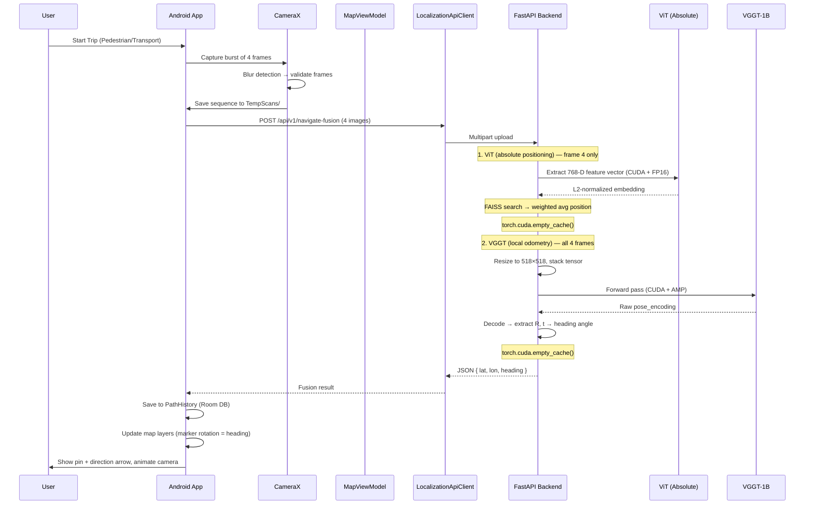

# NaviSense 2.0 — Project Architecture

## Project Overview

**NaviSense 2.0** is a single-screen, GPS-denied mobile navigation app. All ML processing (ViT for absolute coordinates, VGGT for visual odometry) happens **sequentially** on the backend to prevent GPU OOM. The Android client is strictly a "dumb" terminal: it captures burst photos, sends them, saves the returned coordinates locally, and renders the UI map layers.

The core value proposition: **point your phone's camera at your surroundings, and NaviSense tells you where you are** — no GPS required. The app captures 4 photos, sends them to the ML backend, which uses a Vision Transformer (ViT) to determine absolute position, while VGGT computes local 3D camera offset from image sequences (heading + trajectory). The result is a precise WGS-84 coordinate + heading returned to the map interface.

The project is split into two major components:

- **`backend/`** — Python/FastAPI server running PyTorch-based ML models (ViT, VGGT-1B) with **NVIDIA GPU (CUDA) acceleration**
- **`mobile/`** — Kotlin/Android app with CameraX, Google Maps SDK, Room database, and Retrofit networking

---

## Tech Stack

### Backend (Python)

| Technology | Purpose |
|---|---|
| [`FastAPI`](backend/requirements.txt:1) | REST API framework with automatic OpenAPI docs |
| [`Uvicorn`](backend/requirements.txt:2) | ASGI server |
| [`PyTorch`](backend/requirements.txt:3) | Deep learning framework (CUDA-enabled) |
| [`Transformers`](backend/requirements.txt:4) (HuggingFace) | Model loading (ViT) |
| [`Pillow`](backend/requirements.txt:5) | Image loading and preprocessing |
| [`NumPy`](backend/requirements.txt:6) | Numerical operations |
| [`Docker`](backend/Dockerfile:1) | Containerized deployment (Python 3.12-slim) |

#### GPU Accelerations

All ML models leverage **NVIDIA CUDA** when available:

| Optimisation | Scope | Details |
|---|---|---|
| **CUDA auto-detection** | `VGGTProcessor`, ViT | Model device auto-selected (`cuda` if available, else `cpu`) |
| **FP16 (Half Precision)** | ViT, VGGT | Models cast to `.half()` on GPU for 2× faster inference on Tensor Cores; input tensors also cast to FP16 before forward pass |
| **`@torch.inference_mode()`** | ViT forward pass | Faster than `torch.no_grad()` — disables gradient tracking AND ops-specific inference hooks |
| **`torch.cuda.amp.autocast()`** | `VGGTProcessor.get_full_odometry()` | Automatic Mixed Precision for the VGGT-1B forward pass; enables FP16 matrix multiplications while keeping critical ops in FP32 |

### ML Models

| Model | Source | Dimension | Used By | Purpose | GPU Opt |
|---|---|---|---|---|---|
| **ViT** (ViT-B/16) | `google/vit-base-patch16-224` | 768-D | `POST /api/v1/navigate-fusion` | Absolute positioning (frame 4) | CUDA + FP16 + `inference_mode()` |
| **VGGT-1B** | `facebook/VGGT-1B` | N/A | `POST /api/v1/navigate-fusion` | 3D relative camera pose from image sequences (frames 1-4) | CUDA + `autocast()` FP16 |

### Frontend — Android (Kotlin)

| Library | Purpose |
|---|---|
| [`CameraX`](mobile/android/app/build.gradle.kts:137) (1.4.1) | Camera preview and single-frame capture with on-device blur detection |
| [`Retrofit 2`](mobile/android/app/build.gradle.kts:131) + OkHttp | HTTP client for backend API communication |
| [`Google Maps SDK`](mobile/android/app/build.gradle.kts:122) | Map display, markers, circles, polylines |
| [`Google Maps Services`](mobile/android/app/build.gradle.kts:120) | Directions API with waypoint optimisation + **Travel Modes** (Walking/Driving) |
| [`Room`](mobile/android/app/build.gradle.kts:146) (SQLite) | Local persistence (`PathHistory`) |
| [`Coil`](mobile/android/app/build.gradle.kts:143) | Image loading |
| [`KSP`](mobile/android/app/build.gradle.kts:8) | Room annotation processing |
| `Material 3` | UI components (chips, bottom sheets, dialogs) |

---

## Use Cases & User Scenarios

* **UC1: Mode Selection:** User toggles between "🚶 Pedestrian" and "🚗 Transport" modes. Both modes allow entering a Destination to draw a **Blue Route** (via Google Directions API).
* **UC2: Test Mode:** A "Test" button bypasses the camera, taking 4 mock frames from `assets/mock_frames` and sending them to the backend to test the full network/ML pipeline.
* **UC3: Transport Trip (Auto-Scan):** User taps "Start Trip". The app automatically captures 4 photos every 60 seconds, sends them to the backend, and updates the map.
* **UC4: Pedestrian Trip (Manual-Scan):** User taps "Start Trip". Since pedestrians move unpredictably, updates are manual. User taps "Update Location", the app prompts *"Take 3-4 steps forward while pointing the camera"*, captures 4 frames, and updates the map.
* **UC5: Stale Data Degradation:** If no location update is received for >5 minutes, the current green path and marker turn **Gray** to indicate stale/degraded data.
* **UC6: Off-Route Detection & Recovery:** If a newly returned coordinate deviates significantly from the planned Blue Route:
  1. *First deviation:* Alert user -> *"You seem to be off route. Please update location from another angle."*
  2. *Second deviation:* The app recalculates the Blue Route from the new confirmed location to the destination.

---

## Map Rendering Logic (Layering)

1. **The Blue Line (Planned Route):** Generated by Google Directions API. Adapts to the mode (driving vs. walking).
2. **The Green Line (History):** Drawn from the local Room Database (`PathHistory`). Connects previously visited coordinates.
   * *Transport Mode:* The green line is passed through the `Google Maps Snap to Roads API` to align perfectly with streets.
   * *Pedestrian Mode:* Drawn directly point-to-point.
3. **The User Marker:** Placed at `current_location`. Its `rotation` is set to `heading` (from VGGT) to show the user's facing direction.

---

## Architectural Rules

* **Storage Strategy:** Images are NEVER stored as BLOBs in SQL/Room databases. Both frontend and backend save images to local disk folders (`TempScans/` for Android, `data/keyframes/` for Backend) and pass relative/absolute file paths to the ML processors or DB.
* **ML Pipeline Execution:** ViT and VGGT MUST be executed sequentially (ViT first, then VGGT) with `torch.cuda.empty_cache()` called in between. Never run heavy ML models concurrently to prevent CUDA Out-Of-Memory errors.
* **No Mock Classes:** If PyTorch, ViT, or VGGT fails to load, return HTTP 500. No fallback mock implementations.
* **Android:** Single-screen architecture (MapFragment + MapViewModel). All other screens removed.
* **Database (Room):** Single `PathHistory` table (id, lat, lon, heading, timestamp, transportMode). History is NEVER deleted when switching modes, only appended.

---

## Architecture Diagram / Data Flow

### Primary Flow: "Scan & Walk" — Burst Capture + Sensor Fusion



---

## Backend Structure

### Directory Layout

```text
backend/
├── Dockerfile                          # Container build
├── requirements.txt                    # Python dependencies
├── README.md                           # Backend documentation
└── app/
    ├── __init__.py
    ├── main.py                         # FastAPI app + single endpoint
    ├── vggt_processor.py              # VGGT-1B wrapper for 3D odometry (AMP)
    └── vggt/                          # VGGT-1B model files
```

### API Endpoints

All endpoints defined in `backend/app/main.py`.

| Endpoint | Method | Input | Output | Description |
|---|---|---|---|---|
| `/` | GET | — | `{"message": "NaviSense 2.0 API"}` | Root welcome |
| `/api/v1/health` | GET | — | `{"status": "ok", "version": "2.0.0"}` | Health check |
| `/api/v1/navigate-fusion` | POST | **4 multipart images** (field: `files`) | `{"lat": float, "lon": float, "heading": float}` | Sequential Fusion: ViT (absolute) then VGGT-1B (odometry) with `torch.cuda.empty_cache()` in between |

#### `POST /api/v1/navigate-fusion` Details

The **only** ML endpoint. Accepts exactly 4 images under the `files` multipart field. Processing pipeline:

1. **Validation** — exactly 4 non-empty images required.
2. **Sequential Execution** — ViT runs first (absolute positioning on frame 4), then `torch.cuda.empty_cache()`, then VGGT (odometry on all 4 frames), then `torch.cuda.empty_cache()` again. Never parallel.
3. **ViT Pipeline** — `google/vit-base-patch16-224`, extracts [CLS] token, L2-normalises, searches FAISS index (placeholder until real index is built).
4. **VGGT Pipeline** — each image resized to 518×518, converted to `(1, 4, 3, 518, 518)` tensor, moved to CUDA + FP16, `get_full_odometry()` with AMP autocast.
5. **Heading Calculation** — `atan2(heading_x, heading_y)` → degrees, normalised to `[0, 360)`.
6. **Response** — simplified `{"lat": float, "lon": float, "heading": float}`.

---

## Frontend Structure

### Directory Layout

```text
mobile/android/
├── build.gradle.kts                     # Top-level (AGP 8.2.2, Kotlin 1.9.22, KSP)
├── gradle.properties
├── local.properties                     # MAPS_API_KEY (gitignored)
├── app/
│   ├── build.gradle.kts                 # Module build (SDK 34, min 26)
│   ├── proguard-rules.pro
│   └── src/main/
│       ├── AndroidManifest.xml
│       ├── res/
│       │   ├── layout/
│       │   │   ├── activity_main.xml
│       │   │   └── fragment_map.xml     # Single screen layout
│       │   ├── drawable/
│       │   │   └── ic_launcher_foreground.xml
│       │   ├── values/strings.xml       # English
│       │   ├── values-uk/strings.xml    # Ukrainian
│       │   └── values/colors.xml
│       └── java/com/navisense/
│           ├── NaviSenseApplication.kt
│           ├── MainActivity.kt
│           ├── core/
│           │   ├── NaviSenseApi.kt      # Retrofit interface
│           │   ├── LocalizationApiClient.kt  # HTTP client with retry logic
│           │   ├── FileManagerService.kt    # Temp file management
│           │   └── ScannerCamera.kt         # CameraX capture + blur detection
│           ├── data/
│           │   └── local/
│           │       ├── AppDatabase.kt       # Room DB (PathHistory only)
│           │       ├── PathHistory.kt       # History entity
│           │       └── PathHistoryDao.kt    # DAO with Flow queries
│           └── ui/
│               └── map/
│                   ├── MapFragment.kt       # Single screen (Google Maps)
│                   └── MapViewModel.kt      # Single ViewModel
```

### Core Android Components

#### `ScannerCamera`
CameraX wrapper with:
- Single-frame capture at 1080×1920 resolution.
- On-device blur detection via Laplacian variance (threshold: 100.0).
- Designed for **burst capture** workflows — 4 frames are independently validated and passed to the Fusion endpoint.

#### `FileManagerService`
Manages `TempScans/` directory with:
- Storage space check (min 50 MB free).
- Unique filename generation.
- Secure file deletion after API response.

#### `MapViewModel`
Single ViewModel managing:
- **Mode selection:** Pedestrian / Transport.
- **Trip state:** Idle / Running.
- **Location updates:** Periodic (Transport) or manual (Pedestrian) capture → API call → Room save.
- **Route building:** Google Directions API integration.
- **Stale data detection:** 5-minute timeout → gray marker/path.
- **Off-route detection:** Deviation from Blue Route → alert → recalculate.

---

## Current State & Known Blockers

### ✅ Status: Done
* **CUDA OOM on Fusion Endpoint (Fix Applied):** The *RuntimeError: CUDA out of memory* caused by `asyncio.gather()` running ViT and VGGT-1B concurrently on the GPU has been resolved. Both models now execute **sequentially** (ViT first, then `torch.cuda.empty_cache()`, then VGGT, then `torch.cuda.empty_cache()` again). The architectural rule in `.clinerules` and `PROJECT_ARCHITECTURE.md` has been updated to mandate sequential ML pipeline execution.
* **NaviSense 2.0 Pruning Complete:** All unused Android screens (Pedestrian, Transport, VisualSearch, Analytics, Add, Route, Details), ViewModels, models, layouts, and backend files (feature_extractor.py, vector_db.py, init_vector_db.py, test_processor.py) have been deleted. The backend has been rewritten as a single-endpoint API with no mock classes. `.clinerules` and `PROJECT_ARCHITECTURE.md` updated to reflect NaviSense 2.0 architecture.
* **CameraX Race Condition Fix (Phase 2):** Added `isCameraReady: StateFlow<Boolean>` to `ScannerCamera.kt`. The flow emits `true` only after `cameraProvider.bindToLifecycle()` completes successfully in `bindCameraUseCases()`, and resets to `false` on `shutdown()`. Consumers must observe this flow before calling `captureBurst()` or `captureSharpImage()`.
* **Test Button & Map Rendering (Phase 2):** The "Test" button in `MapFragment.kt` is fully wired. When clicked, it extracts 4 mock frames from `assets/mock_frames/`, calls `LocalizationApiClient.navigateFusion()`, and appends the `FusionResponse` to `MapViewModel.pathHistory`. The `renderPath()` method observes `pathHistory` via `StateFlow`, clears the map, draws a green polyline, places a rotated marker at the latest point (using `heading` for rotation), and animates the camera to zoom ~18f.

### 🔧 TODO: FAISS Index Integration
The ViT pipeline in `main.py` currently returns a placeholder position (Kyiv centre). To restore real absolute positioning:
1. Build a FAISS index from geo-tagged reference images.
2. Integrate FAISS search into `_run_vit_sync()`.
3. Add `faiss-cpu` back to `requirements.txt` if needed.
