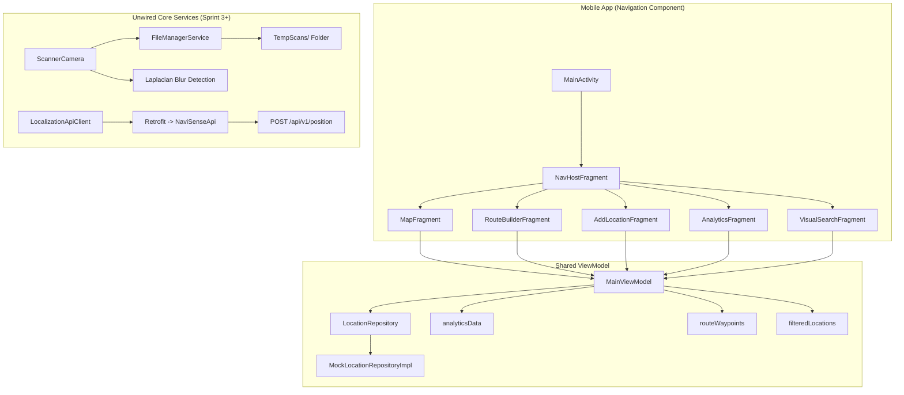
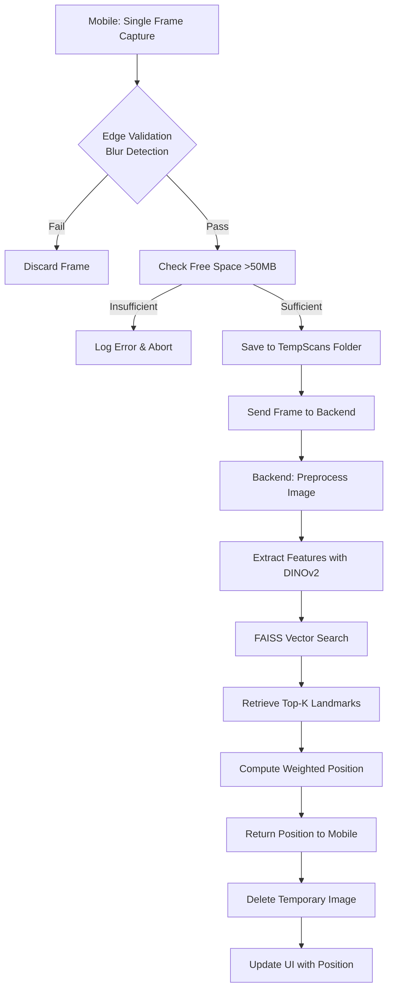

# NaviSense MVP — Single Source of Truth

## 1. Project Goal
NaviSense is a visual positioning mobile application designed for couriers operating in GPS‑denied urban environments (e.g., indoor warehouses, dense urban canyons, underground facilities). The MVP provides real‑time location estimation using a single camera frame, without relying on GPS signals or continuous video streaming.

**Core Value Proposition:**
- Deliver sub‑meter positional accuracy in environments where GPS is unavailable or unreliable.
- Enable couriers to navigate complex indoor spaces (shopping malls, office towers, underground parking) with visual cues.
- Minimize latency and battery consumption by using single‑frame captures instead of continuous video.

---

## 2. Tech Stack (Current & Planned)

### Mobile Frontend
- **Platform:** Native Android (minimum SDK 26, target SDK 34)
- **Language:** Kotlin (no cross‑platform frameworks)
- **Architecture:** Single‑Activity with Navigation Component + BottomNavigationView (5 tabs)
- **Key Libraries:**
  - **Navigation Component 2.7.7** — fragment-based navigation with `NavHostFragment` and Bottom Navigation
  - **CameraX 1.4.1** for single‑frame image capture
    - Resolution selector targeting 1080×1920 (portrait)
    - Capture mode: `MINIMIZE_LATENCY`
    - Built‑in `ImageProxy.toBitmap()` (CameraX 1.4+)
  - **Google Maps SDK (play-services-maps:18.2.0)** for map display
  - **Maps-Utils-KTx (5.0.0)** for enhanced map utilities
  - **Play Services Location (21.1.0)** for FusedLocationProviderClient
  - **Retrofit2 + OkHttp4** for REST communication
    - Base URL configurable via `BuildConfig.BACKEND_URL`
    - Timeout: 15 seconds connect, 30 seconds read/write
    - Multipart file upload with JPEG compression quality 85%
    - Logging interceptor (HTTP body logging in debug)
  - **Coil 2.5.0** for image loading
  - **Room** for local caching *(planned — not yet implemented; `build.gradle.kts` does not include Room dependency)*
  - **Material3** for UI components (chips, cards, bottom sheets, bottom navigation)
  - OpenCV‑Android *not used* — custom Kotlin Laplacian variance used for blur detection

### Backend
- **Runtime:** Python 3.10+
- **Web Framework:** FastAPI (ASGI, automatic OpenAPI docs at `/docs`)
- **ML/DL Stack:**
  - PyTorch 2.11.0 (with GPU support if available)
  - Hugging Face Transformers 4.35.0 (DINOv2‑base model for feature extraction)
    - Model variant: `facebook/dinov2‑base` (ViT‑B/14)
    - Input resolution: 224×224 pixels, normalized with ImageNet mean/std
    - Output feature dimension: 768‑dimensional vector, L2-normalized
    - Inference device: GPU if available, otherwise CPU with FP16 precision
  - FAISS (cpu 1.13.2) for vector search
    - Index type: `IndexFlatL2` (exact L2 distance) for up to 100k landmarks; `IndexIVFFlat` for larger datasets
    - Dimension: 768 (matches DINOv2 output)
    - Metric: L2 (Euclidean) distance
    - Index built offline from landmark feature vectors; stored as binary file loaded at startup
  - **Mock fallback mode** — if torch/transformers/faiss are unavailable, the backend auto-falls back to mock implementations returning random positions
- **Utilities:**
  - Pillow/PIL for image preprocessing
  - NumPy, SciPy for numerical operations
  - Uvicorn as ASGI server
  - python-multipart for file uploads
  - pydantic for data validation
  - python-dotenv for environment configuration
  - httpx for async HTTP testing
  - pytest + pytest-asyncio for testing
- **API Endpoints:**
  - `GET /` — root welcome message
  - `GET /api/v1/health` — returns `{"status": "ok"}` if backend is ready.
  - `POST /api/v1/position` — upload a JPEG image (max 5 MB); returns JSON with `latitude`, `longitude`, `floor`, `confidence`, `nearest_landmarks`.
  - `POST /api/v1/calibrate` — (placeholder) upload a calibration image to adjust blur‑detection threshold; returns `{"message": "Calibration endpoint (not implemented)"}`.

### Infrastructure & DevOps
- **Version Control:** Git with GitHub Gitflow branching model
- **CI/CD:** GitHub Actions (build, test, deploy) — *(planned)*
- **Containerization:** Docker (see [`backend/Dockerfile`](backend/Dockerfile))
- **Database:** PostgreSQL 14+ (for metadata, user sessions, landmark catalog) — *(planned)*
- **Cloud Provider:** AWS / GCP (TBD)

---

## 3. Architecture — Current State

The app has evolved from a single-screen MVP into a multi-tab Location Management application with a clean fragment-based architecture.



### Tab Overview

| # | Tab | Fragment | Description |
|---|-----|----------|-------------|
| 1 | Map (Home) | [`MapFragment`](mobile/android/app/src/main/java/com/navisense/ui/map/MapFragment.kt) | Full‑screen Google Map with category filter chips (All, Monument, Grocery, etc.), radius filter (1/2/5/10 km), My‑Location FAB, location markers with colored icons by category, mock match marker drop |
| 2 | Routes | [`RouteBuilderFragment`](mobile/android/app/src/main/java/com/navisense/ui/route/RouteBuilderFragment.kt) | Split view: map (top) + selectable waypoint list (bottom). Polyline connects selected waypoints; "Start Navigation" launches Google Maps external app to final destination |
| 3 | Add (+) | [`AddLocationFragment`](mobile/android/app/src/main/java/com/navisense/ui/add/AddLocationFragment.kt) | Map picker + form (title, description, category dropdown, photo attachment from gallery/camera). Saves via ViewModel → Repository |
| 4 | Analytics | [`AnalyticsFragment`](mobile/android/app/src/main/java/com/navisense/ui/analytics/AnalyticsFragment.kt) | Custom Canvas-drawn PieChart (category distribution) + BarChart (visited vs not visited) + total location count |
| 5 | Visual Search | [`VisualSearchFragment`](mobile/android/app/src/main/java/com/navisense/ui/search/VisualSearchFragment.kt) | Upload or take a photo → 2‑second loading spinner (mocking ML inference) → navigates to Map and drops a yellow mock-match marker |

### Full Vision Flow (Camera → Backend → Position)



> **Current state:** Steps 1–2 (CameraX + blur detection) are implemented in [`ScannerCamera.kt`](mobile/android/app/src/main/java/com/navisense/core/ScannerCamera.kt) but **not wired** into any fragment. Steps 3–9 are fully implemented in the backend but the mobile → backend integration (`LocalizationApiClient`) is also **not wired**.

---

## 4. Database Schema (Planned — PostgreSQL)

```sql
-- Registered couriers
CREATE TABLE users (
    id UUID PRIMARY KEY DEFAULT gen_random_uuid(),
    email VARCHAR(255) UNIQUE NOT NULL,
    hashed_password VARCHAR(255) NOT NULL,
    full_name VARCHAR(255),
    created_at TIMESTAMP WITH TIME ZONE DEFAULT CURRENT_TIMESTAMP,
    last_login TIMESTAMP WITH TIME ZONE
);

-- Active sessions (JWT tokens optional)
CREATE TABLE sessions (
    id UUID PRIMARY KEY DEFAULT gen_random_uuid(),
    user_id UUID REFERENCES users(id) ON DELETE CASCADE,
    device_id VARCHAR(255),
    started_at TIMESTAMP WITH TIME ZONE DEFAULT CURRENT_TIMESTAMP,
    expires_at TIMESTAMP WITH TIME ZONE,
    is_active BOOLEAN DEFAULT TRUE
);

-- Known landmarks (pre‑indexed visual features)
CREATE TABLE landmarks (
    id UUID PRIMARY KEY DEFAULT gen_random_uuid(),
    building_id UUID NOT NULL,
    floor INTEGER NOT NULL,
    latitude DOUBLE PRECISION NOT NULL,
    longitude DOUBLE PRECISION NOT NULL,
    altitude DOUBLE PRECISION,
    feature_vector BYTEA,
    image_path VARCHAR(512),
    created_at TIMESTAMP WITH TIME ZONE DEFAULT CURRENT_TIMESTAMP,
    UNIQUE(building_id, floor, latitude, longitude)
);

-- Historical scans (for analytics and retraining)
CREATE TABLE scans (
    id UUID PRIMARY KEY DEFAULT gen_random_uuid(),
    user_id UUID REFERENCES users(id) ON DELETE SET NULL,
    session_id UUID REFERENCES sessions(id) ON DELETE SET NULL,
    landmark_id UUID REFERENCES landmarks(id) ON DELETE SET NULL,
    image_path VARCHAR(512) NOT NULL,
    estimated_latitude DOUBLE PRECISION,
    estimated_longitude DOUBLE PRECISION,
    estimated_floor INTEGER,
    confidence_score FLOAT,
    processed_at TIMESTAMP WITH TIME ZONE DEFAULT CURRENT_TIMESTAMP,
    deleted_from_device BOOLEAN DEFAULT TRUE
);

-- Buildings & floor plans
CREATE TABLE buildings (
    id UUID PRIMARY KEY DEFAULT gen_random_uuid(),
    name VARCHAR(255) NOT NULL,
    address TEXT,
    geo_boundary POLYGON,
    map_tile_url_template VARCHAR(512)
);
```

---

## 5. Strict Validation Rules (Planned for Full System)

### 5.1 Low Latency Requirement
- **Single‑frame only:** The mobile app must never stream video to the backend. Each positioning request corresponds to exactly one captured image.
- **End‑to‑end latency target:** < 2 seconds (from capture to position display), excluding network round‑trip.
- **On‑device preprocessing:** Resize and compression must be performed before transmission; the uploaded JPEG shall not exceed 500 KB.

### 5.2 File I/O & Storage Policies
1. **TempScans Folder:** All temporary images must be saved exclusively to `[App Internal Storage]/TempScans/`. No other directory may be used for this purpose.
2. **Free‑space Check:** Before any file write, the app must verify that at least **50 MB** of free space is available on the device's internal storage. If the check fails, the operation is aborted and an error is appended to `error_logs.txt`.
3. **Immediate Deletion:** After successful backend transmission (HTTP 200 response), the temporary image file must be deleted **before** updating the UI. If transmission fails, the file may be kept for retry (max 3 attempts) but must be deleted after the final failure.
4. **No Persistence:** No captured image may remain on the device for longer than 5 minutes, regardless of success or failure.

### 5.3 Edge Validation (Blur Detection)
- Every captured frame must undergo a blur‑detection test before hitting the file system or network.
- **Algorithm:** Compute the Laplacian variance of the grayscale version of the image. If the variance is below a calibrated threshold (default: 100.0), the frame is considered too blurry and is discarded.
- **Performance:** The blur‑detection routine must complete in < 100 ms on a mid‑range Android device.

### 5.4 Error Handling & Logging
- **Error Logs:** All runtime errors (I/O, network, validation failures) must be appended to `error_logs.txt` in the app's internal storage, with a timestamp, error code, and brief description.
- **Retry Logic:** Network requests that timeout or return 5xx status codes are retried up to 3 times with exponential backoff (1s → 2s → 4s).
- **User Feedback:** Non‑technical errors (e.g., "image too blurry", "insufficient storage") are displayed as user‑friendly toasts; technical errors are logged silently.

### 5.5 Security & Privacy
- **Image Transmission:** All images are transmitted over HTTPS with certificate pinning *(planned — HTTP used in development)*.
- **No Personal Data:** The app must not capture or transmit any personally identifiable information (PII) embedded in the image. If face‑like regions are detected (optional), the image is discarded.
- **Local Storage:** The TempScans folder is located in the app's internal storage, which is sandboxed and inaccessible to other apps.

---

## 6. Development Workflow (Gitflow)

- **Main Branches:**
  - `main` – production‑ready code, tagged releases.
  - `develop` – integration branch for completed features.
- **Feature Branches:** `feature/*` branched from `develop`. Must pass code review and CI before merging.
- **Release Branches:** `release/*` for final testing, version bumping, and documentation updates.
- **Hotfix Branches:** `hotfix/*` branched from `main` for urgent production fixes.

**CI/CD Pipeline (Planned):**
1. On push to `feature/*` – run unit tests (Android: Gradle, Backend: pytest).
2. On merge to `develop` – build Docker images, run integration tests.
3. On merge to `main` – deploy to staging environment (auto) and optionally to production (manual approval).

---

## 7. Current Implementation Status

### 7.1 Sprint Overview

The project has evolved through two major phases:

- **Sprint 1 (Complete):** Delivered a single-screen UI shell with Google Maps integration, runtime permission handling, mock marker placement, CameraX capture module, FileManagerService, LocalizationApiClient, and bilingual (EN/UK) resources. Much of this remains unwired.

- **Sprint 2 (In Progress / Near Complete):** Refactored the monolithic `MainActivity` into a **5-tab Navigation Component** architecture. Implemented `MapFragment`, `AddLocationFragment`, `RouteBuilderFragment`, `AnalyticsFragment`, `VisualSearchFragment`, shared `MainViewModel` with `LocationRepository` pattern, `AppLocation`/`AppLocationCategory` models, custom chart views, and mock visual search flow. Backend received full ML pipeline (DINOv2 + FAISS) with mock fallback mode and Docker support.

### 7.2 What Works (Verified)

#### Sprint 1 Features (Carried Forward)

| Feature | Status | Details |
|---|---|---|
| **Google Maps Display** | ✅ Working | `SupportMapFragment` renders map tiles in `MapFragment`. Default camera centres on Kyiv (50.4501, 30.5234) at zoom 13. |
| **Map UI Controls** | ✅ Working | Zoom controls (`+`/`–` buttons) enabled. Map toolbar disabled for MVP simplicity. |
| **CameraX ScannerCamera** | ✅ Implemented (not wired) | [`ScannerCamera.kt`](mobile/android/app/src/main/java/com/navisense/core/ScannerCamera.kt): `ResolutionSelector`, Laplacian variance blur detection (threshold 100.0), `captureSharpImage()` callback, `ImageTooBlurryException`. **Not instantiated in any fragment.** |
| **FileManagerService** | ✅ Implemented (not wired) | [`FileManagerService.kt`](mobile/android/app/src/main/java/com/navisense/core/FileManagerService.kt): TempScans folder, 50 MB free‑space check, UUID file naming, error logging, `prepareImagePart()` for Retrofit multipart upload. **Not called from any fragment.** |
| **LocalizationApiClient** | ✅ Implemented (not wired) | [`LocalizationApiClient.kt`](mobile/android/app/src/main/java/com/navisense/core/LocalizationApiClient.kt): Retrofit client, OkHttp timeouts (15s/30s/30s), retry logic (3 attempts with exponential backoff), file cleanup after success/failure. **Not called from any fragment.** |
| **NaviSenseApi** | ✅ Implemented (not wired) | [`NaviSenseApi.kt`](mobile/android/app/src/main/java/com/navisense/core/NaviSenseApi.kt): Retrofit interface with `uploadImage()` multipart endpoint. `PositionResponse` and `Landmark` data classes. |
| **Bilingual UI** | ✅ Working | Full English (`values/`) and Ukrainian (`values‑uk/`) string resources for all UI labels and messages. |

#### Sprint 2 Features (New)

| Feature | Status | Details |
|---|---|---|
| **Navigation Component + Bottom Nav** | ✅ Fully Implemented | 5-tab navigation: Map, Routes, Add, Analytics, Visual Search. [`NavHostFragment`](mobile/android/app/src/main/res/layout/activity_main.xml:12) with [`nav_graph.xml`](mobile/android/app/src/main/res/navigation/nav_graph.xml) and [`bottom_nav_menu.xml`](mobile/android/app/src/main/res/menu/bottom_nav_menu.xml). |
| **Map Fragment with Category Chips** | ✅ Fully Implemented | [`MapFragment`](mobile/android/app/src/main/java/com/navisense/ui/map/MapFragment.kt): Category filter chips (All, Monument, Grocery, Gas Station, Restaurant, Pharmacy) using Material3 `ChipGroup` with single-selection. Filters markers reactively via ViewModel. **Chips now functional** — see resolution below. |
| **Radius Filter on Map** | ✅ Fully Implemented | Cycle button (Off → 1 km → 2 km → 5 km → 10 km). Draws a coloured circle overlay on the map centred on the visible region. |
| **My-Location FAB** | ✅ Fully Implemented | FAB triggers `FusedLocationProviderClient.lastLocation` with `isMyLocationEnabled = true`. Permission request via `ActivityResultContracts.RequestMultiplePermissions()`. |
| **Marker Rendering (coloured by category)** | ✅ Fully Implemented | Markers coloured by `AppLocationCategory` (Red=Monument, Green=Grocery, Orange=Gas Station, Cyan=Restaurant, Blue=Pharmacy). Visited markers shown in Violet. Marker click opens `LocationDetailsBottomSheet`. |
| **Add Location Screen** | ✅ Fully Implemented | [`AddLocationFragment`](mobile/android/app/src/main/java/com/navisense/ui/add/AddLocationFragment.kt): Map picker with tap-to-select coordinates, title/description inputs, category dropdown, photo attachment (gallery or camera), save via ViewModel. |
| **Location Details Bottom Sheet** | ✅ Fully Implemented | [`LocationDetailsBottomSheet`](mobile/android/app/src/main/java/com/navisense/ui/details/LocationDetailsBottomSheet.kt): Shows image, title, category, coordinates, description. "Mark as Visited" toggle and "Delete Location" button. |
| **Route Builder** | ✅ Fully Implemented | [`RouteBuilderFragment`](mobile/android/app/src/main/java/com/navisense/ui/route/RouteBuilderFragment.kt): Split map + waypoint list. Select locations as waypoints, polyline drawn on map, "Start Navigation" opens Google Maps external nav. |
| **Analytics Screen** | ✅ Fully Implemented | [`AnalyticsFragment`](mobile/android/app/src/main/java/com/navisense/ui/analytics/AnalyticsFragment.kt): Custom Canvas-drawn [`PieChartView`](mobile/android/app/src/main/java/com/navisense/ui/analytics/PieChartView.kt) (category distribution) and [`BarChartView`](mobile/android/app/src/main/java/com/navisense/ui/analytics/BarChartView.kt) (visited vs not visited). Total location count card. |
| **Visual Search (Mock)** | ✅ Fully Implemented | [`VisualSearchFragment`](mobile/android/app/src/main/java/com/navisense/ui/search/VisualSearchFragment.kt): Upload/take photo → 2-second loading spinner → navigates to Map → drops yellow mock-match marker. **No actual ML inference on device.** |
| **MainViewModel (Refactored)** | ✅ Fully Implemented | [`MainViewModel`](mobile/android/app/src/main/java/com/navisense/ui/MainViewModel.kt): Shared AndroidViewModel with `LocationRepository` pattern, `filteredLocations` via `combine()`, `analyticsData`, `routeWaypoints`, `mockMatchLocation`. CRUD, route toggle, mock match. |
| **LocationRepository Pattern** | ✅ Fully Implemented | [`LocationRepository`](mobile/android/app/src/main/java/com/navisense/data/LocationRepository.kt) interface + [`MockLocationRepositoryImpl`](mobile/android/app/src/main/java/com/navisense/data/MockLocationRepositoryImpl.kt) with 10 Kyiv landmarks as seed data. Designed for future Room swap. |
| **AppLocation Model** | ✅ Fully Implemented | [`AppLocation`](mobile/android/app/src/main/java/com/navisense/model/AppLocation.kt): `@Parcelize` data class with `id`, `title`, `description`, `latitude`, `longitude`, `category`, `imageUri`, `isVisited`. |
| **AppLocationCategory Enum** | ✅ Fully Implemented | [`AppLocationCategory`](mobile/android/app/src/main/java/com/navisense/model/AppLocationCategory.kt): `MONUMENT`, `GROCERY`, `GAS_STATION`, `RESTAURANT`, `PHARMACY`. Companion `names` and `fromKey()` parser. |
| **Backend — Full ML Pipeline** | ✅ Fully Implemented | [`feature_extractor.py`](backend/app/feature_extractor.py): DINOv2-base model loading, 768-dim feature extraction, L2 normalization. [`vector_db.py`](backend/app/vector_db.py): FAISS IndexFlatL2, add/search/save/load, demo index with 1000 random Kyiv landmarks. |
| **Backend — FastAPI Server** | ✅ Fully Implemented | [`main.py`](backend/app/main.py): 4 endpoints (`/`, `/health`, `/position`, `/calibrate`), file validation (JPEG only, max 5 MB), weighted position averaging, mock fallback mode, error handling. |
| **Backend — Docker Support** | ✅ Fully Implemented | [`Dockerfile`](backend/Dockerfile): Python 3.10-slim, system deps for torch/faiss, pip installs requirements, exposes port 8000. |
| **Backend — Mock Fallback** | ✅ Fully Implemented | When torch/transformers/faiss are unavailable, `main.py` auto-creates `MockExtractor` (random 768-dim vectors) and `MockVectorDB` (1000 random Kyiv landmarks). |

### 7.3 Known Issues & Gaps

| Issue | Impact | Status / Notes |
|---|---|---|
| **CameraX not wired into any fragment** | ❌ The visual positioning pipeline cannot start. | [`ScannerCamera`](mobile/android/app/src/main/java/com/navisense/core/ScannerCamera.kt) is fully built but never instantiated. Needs integration into a camera capture flow (likely via `VisualSearchFragment` or a dedicated positioning screen). **Priority for Sprint 3.** |
| **ML Backend not deployed / reachable** | ❌ `LocalizationApiClient` will fail to connect. | Backend code exists and is runnable (Docker or `uvicorn`), but no cloud host is configured. `BuildConfig.BACKEND_URL` defaults to `http://10.0.2.2:8000/` (emulator localhost). |
| **Room database not implemented** | ❌ All location data is in-memory; lost on app restart. | `build.gradle.kts` has no Room dependency. `MockLocationRepositoryImpl` serves as placeholder. The `DeliveryHistory.kt`, `DeliveryHistoryDao.kt`, `AppDatabase.kt`, and `NaviSenseApplication.kt` files referenced in some documentation **do not exist on disk**. |
| **User geolocation blue dot — intermittent** | ⚠️ The My-Location blue dot may not appear on first launch. | [`MapFragment.enableMyLocation()`](mobile/android/app/src/main/java/com/navisense/ui/map/MapFragment.kt:229) uses `FusedLocationProviderClient.lastLocation` which returns `null` if no prior location is cached. Workaround planned: use `getCurrentLocation()` with `PRIORITY_HIGH_ACCURACY`. |
| **Filter Chips — resolved from Sprint 1** | ✅ Fixed | The old `MainActivity`-based filter chips were non-functional. The new [`MapFragment`](mobile/android/app/src/main/java/com/navisense/ui/map/MapFragment.kt) uses `ChipGroup` with `isSingleSelection=true` and the refactored [`MainViewModel`](mobile/android/app/src/main/java/com/navisense/ui/MainViewModel.kt) correctly combines `allLocations` + `selectedCategory` via `combine()`. |
| **Category filter treats MONUMENT as "All"** | ⚠️ Minor UX bug | In [`MainViewModel.filteredLocations`](mobile/android/app/src/main/java/com/navisense/ui/MainViewModel.kt:47), `category == null || category == AppLocationCategory.MONUMENT.key` both show all locations. This means clicking "Monument" chip shows everything. Intentional for MVP? Needs clarification. |
| **Analytics only recomputes on allLocations changes** | ⚠️ Minor | [`analyticsData`](mobile/android/app/src/main/java/com/navisense/ui/MainViewModel.kt:75) combines `allLocations` with a dummy `MutableStateFlow(Unit)`. The Flow works but the `combine` with `Unit` is unconventional. |
| **16 KB page‑size alignment (Android 15)** | ✅ Fixed (verified) | CameraX 1.4.1 + `packaging { jniLibs { useLegacyPackaging = true } }` added in `build.gradle.kts`. |

### 7.4 Files Summary

#### Mobile (Android)

| File | Purpose |
|---|---|
| [`mobile/android/settings.gradle.kts`](mobile/android/settings.gradle.kts) | Root project name "NaviSense", includes `:app` module |
| [`mobile/android/build.gradle.kts`](mobile/android/build.gradle.kts) | Project‑level: AGP 8.2.2, Kotlin 1.9.22 |
| [`mobile/android/gradle.properties`](mobile/android/gradle.properties) | AndroidX, parallel builds, JVM args |
| [`mobile/android/gradle/wrapper/gradle-wrapper.properties`](mobile/android/gradle/wrapper/gradle-wrapper.properties) | Gradle 8.5 distribution |
| [`mobile/android/app/build.gradle.kts`](mobile/android/app/build.gradle.kts) | App‑level: CameraX 1.4.1, Maps SDK 18.2.0, Retrofit 2.9, OkHttp 4.12, Navigation 2.7.7, Coil 2.5.0, Maps Utils KTx 5.0.0, Location 21.1.0, packaging block for 16 KB alignment |
| [`mobile/android/app/src/main/AndroidManifest.xml`](mobile/android/app/src/main/AndroidManifest.xml) | Permissions (INTERNET, CAMERA, FINE/COARSE LOCATION, ACCESS_NETWORK_STATE), Maps API key meta‑data, single‑activity launcher |
| [`mobile/android/app/src/main/java/com/navisense/MainActivity.kt`](mobile/android/app/src/main/java/com/navisense/MainActivity.kt) | Single Activity hosting `NavHostFragment` + `BottomNavigationView` |
| [`mobile/android/app/src/main/java/com/navisense/ui/MainViewModel.kt`](mobile/android/app/src/main/java/com/navisense/ui/MainViewModel.kt) | Shared AndroidViewModel: `allLocations`, `selectedCategory`, `filteredLocations`, `selectedRadiusKm`, `routeWaypoints`, `mockMatchLocation`, `analyticsData`. CRUD, route toggle, mock match. |
| [`mobile/android/app/src/main/java/com/navisense/model/AppLocation.kt`](mobile/android/app/src/main/java/com/navisense/model/AppLocation.kt) | `@Parcelize` data class: `id`, `title`, `description`, `latitude`, `longitude`, `category`, `imageUri`, `isVisited` |
| [`mobile/android/app/src/main/java/com/navisense/model/AppLocationCategory.kt`](mobile/android/app/src/main/java/com/navisense/model/AppLocationCategory.kt) | Enum: `MONUMENT`, `GROCERY`, `GAS_STATION`, `RESTAURANT`, `PHARMACY` |
| [`mobile/android/app/src/main/java/com/navisense/model/MarkerItem.kt`](mobile/android/app/src/main/java/com/navisense/model/MarkerItem.kt) | `@Parcelize` data class: legacy model for Sprint 1 markers (transport-mode tags: Walking, Bicycle, Car). Used only in old `MainActivity` code — **may be dead code now** |
| [`mobile/android/app/src/main/java/com/navisense/data/LocationRepository.kt`](mobile/android/app/src/main/java/com/navisense/data/LocationRepository.kt) | Repository interface: `getAllLocations()`, `getLocationById()`, `insertLocation()`, `updateLocation()`, `deleteLocation()`, `toggleVisited()` |
| [`mobile/android/app/src/main/java/com/navisense/data/MockLocationRepositoryImpl.kt`](mobile/android/app/src/main/java/com/navisense/data/MockLocationRepositoryImpl.kt) | In-memory mock with 10 Kyiv landmarks as seed data |
| [`mobile/android/app/src/main/java/com/navisense/ui/map/MapFragment.kt`](mobile/android/app/src/main/java/com/navisense/ui/map/MapFragment.kt) | Map tab: Google Maps, category chips, radius filter, My-Location FAB, marker rendering by category colour, LocationDetailsBottomSheet on marker click, mock match marker drop |
| [`mobile/android/app/src/main/java/com/navisense/ui/add/AddLocationFragment.kt`](mobile/android/app/src/main/java/com/navisense/ui/add/AddLocationFragment.kt) | Add Location tab: map picker, title/description inputs, category dropdown, photo attachment, save |
| [`mobile/android/app/src/main/java/com/navisense/ui/analytics/AnalyticsFragment.kt`](mobile/android/app/src/main/java/com/navisense/ui/analytics/AnalyticsFragment.kt) | Analytics tab: pie chart + bar chart + total count |
| [`mobile/android/app/src/main/java/com/navisense/ui/analytics/PieChartView.kt`](mobile/android/app/src/main/java/com/navisense/ui/analytics/PieChartView.kt) | Custom Canvas-drawn pie chart with legend |
| [`mobile/android/app/src/main/java/com/navisense/ui/analytics/BarChartView.kt`](mobile/android/app/src/main/java/com/navisense/ui/analytics/BarChartView.kt) | Custom Canvas-drawn bar chart (Visited / Not Visited) |
| [`mobile/android/app/src/main/java/com/navisense/ui/route/RouteBuilderFragment.kt`](mobile/android/app/src/main/java/com/navisense/ui/route/RouteBuilderFragment.kt) | Route Builder tab: map + waypoint list, polyline, Google Maps external navigation |
| [`mobile/android/app/src/main/java/com/navisense/ui/search/VisualSearchFragment.kt`](mobile/android/app/src/main/java/com/navisense/ui/search/VisualSearchFragment.kt) | Visual Search tab: gallery/camera picker → 2-second mock → map marker drop |
| [`mobile/android/app/src/main/java/com/navisense/ui/details/LocationDetailsBottomSheet.kt`](mobile/android/app/src/main/java/com/navisense/ui/details/LocationDetailsBottomSheet.kt) | Bottom sheet: image, title, category, coordinates, description, toggle visited, delete |
| [`mobile/android/app/src/main/java/com/navisense/core/ScannerCamera.kt`](mobile/android/app/src/main/java/com/navisense/core/ScannerCamera.kt) | CameraX wrapper: ResolutionSelector, ImageCapture with MINIMIZE_LATENCY, Laplacian variance blur detection, `captureSharpImage()` callback |
| [`mobile/android/app/src/main/java/com/navisense/core/FileManagerService.kt`](mobile/android/app/src/main/java/com/navisense/core/FileManagerService.kt) | TempScans folder management, 50 MB free‑space check, UUID file naming, error logging |
| [`mobile/android/app/src/main/java/com/navisense/core/LocalizationApiClient.kt`](mobile/android/app/src/main/java/com/navisense/core/LocalizationApiClient.kt) | Retrofit singleton: OkHttp client, retry logic (3 attempts, exponential backoff), `localizeImage()` suspend function |
| [`mobile/android/app/src/main/java/com/navisense/core/NaviSenseApi.kt`](mobile/android/app/src/main/java/com/navisense/core/NaviSenseApi.kt) | Retrofit interface: `uploadImage()` multipart, `PositionResponse`, `Landmark` data classes |
| [`mobile/android/app/src/main/res/layout/activity_main.xml`](mobile/android/app/src/main/res/layout/activity_main.xml) | NavHostFragment + BottomNavigationView |
| [`mobile/android/app/src/main/res/layout/fragment_map.xml`](mobile/android/app/src/main/res/layout/fragment_map.xml) | Map: SupportMapFragment + filter card (ChipGroup + radius button) + FAB |
| [`mobile/android/app/src/main/res/layout/fragment_add_location.xml`](mobile/android/app/src/main/res/layout/fragment_add_location.xml) | Add Location form: map picker, text inputs, dropdown, photo button, save |
| [`mobile/android/app/src/main/res/layout/fragment_analytics.xml`](mobile/android/app/src/main/res/layout/fragment_analytics.xml) | Analytics: PieChartView, BarChartView, total count card |
| [`mobile/android/app/src/main/res/layout/fragment_route_builder.xml`](mobile/android/app/src/main/res/layout/fragment_route_builder.xml) | Route Builder: map (top) + RecyclerView waypoint list + action buttons (bottom) |
| [`mobile/android/app/src/main/res/layout/fragment_visual_search.xml`](mobile/android/app/src/main/res/layout/fragment_visual_search.xml) | Visual Search: upload/take photo buttons + loading spinner overlay |
| [`mobile/android/app/src/main/res/layout/bottom_sheet_location_details.xml`](mobile/android/app/src/main/res/layout/bottom_sheet_location_details.xml) | Location details: image, title, category, coordinates, description, toggle visited, delete |
| [`mobile/android/app/src/main/res/navigation/nav_graph.xml`](mobile/android/app/src/main/res/navigation/nav_graph.xml) | Navigation graph: 5 fragment destinations (map, add, route, analytics, visual search) |
| [`mobile/android/app/src/main/res/menu/bottom_nav_menu.xml`](mobile/android/app/src/main/res/menu/bottom_nav_menu.xml) | Bottom nav: Map, Routes, Add, Analytics, Visual Search |
| [`mobile/android/app/src/main/res/values/strings.xml`](mobile/android/app/src/main/res/values/strings.xml) | English strings (EN) |
| [`mobile/android/app/src/main/res/values-uk/strings.xml`](mobile/android/app/src/main/res/values-uk/strings.xml) | Ukrainian strings (UK) |
| [`mobile/android/app/src/main/res/values/colors.xml`](mobile/android/app/src/main/res/values/colors.xml) | Brand colours, marker colours, radius fill colour |
| [`mobile/android/app/src/main/res/values/themes.xml`](mobile/android/app/src/main/res/values/themes.xml) | Material3 Light NoActionBar theme |
| [`mobile/android/app/proguard-rules.pro`](mobile/android/app/proguard-rules.pro) | Keep rules for Retrofit, Gson, Maps |

#### Backend (Python)

| File | Purpose |
|---|---|
| [`backend/app/__init__.py`](backend/app/__init__.py) | Package marker (empty) |
| [`backend/app/main.py`](backend/app/main.py) | FastAPI application: 4 endpoints, file validation, component lazy-loading, mock fallback |
| [`backend/app/feature_extractor.py`](backend/app/feature_extractor.py) | DINOv2FeatureExtractor: model loading, 768-dim feature extraction, L2 normalization |
| [`backend/app/vector_db.py`](backend/app/vector_db.py) | FAISS VectorDatabase: index creation (flat_l2 / ivf_flat), add/search/save/load, demo index generation |
| [`backend/requirements.txt`](backend/requirements.txt) | Python dependencies: fastapi, uvicorn, torch, transformers, faiss-cpu, pillow, numpy, etc. |
| [`backend/Dockerfile`](backend/Dockerfile) | Docker image: python:3.10-slim, system deps for torch/faiss, pip installs, exposes 8000 |
| [`backend/README.md`](backend/README.md) | Backend documentation: architecture, installation, API, Docker, troubleshooting |

### 7.5 Build & Run Instructions

```bash
# ── Android App ──────────────────────────────────────────────────────

# 1. Configure your Google Maps API key
#    - Open mobile/android/app/src/main/AndroidManifest.xml
#    - Replace the value of com.google.android.geo.API_KEY with your key
#    - Ensure "Maps SDK for Android" is ENABLED in Google Cloud Console

# 2. Clean build (required after cache changes, e.g. CameraX upgrade)
cd mobile/android
./gradlew clean assembleDebug

# 3. Install on device / emulator (API 26+)
./gradlew installDebug

# ── Backend (Python) ─────────────────────────────────────────────────

# 1. Create and activate virtual environment
cd backend
python -m venv venv
# On Windows: venv\Scripts\activate
# On macOS/Linux: source venv/bin/activate

# 2. Install dependencies
pip install -r requirements.txt

# 3. Run in development mode (with mock fallback if torch/faiss missing)
uvicorn app.main:app --reload --host 0.0.0.0 --port 8000

# 4. API docs available at http://localhost:8000/docs

# ── Backend (Docker) ─────────────────────────────────────────────────

cd backend
docker build -t navisense-backend .
docker run -p 8000:8000 navisense-backend
```

### 7.6 Sprint 3 Priority Items

1. **Wire CameraX into Visual Search (or dedicated capture flow)** — Instantiate `ScannerCamera` and integrate with `FileManagerService` + `LocalizationApiClient`. Complete the end‑to‑end pipeline: capture → blur check → save → upload → receive position → delete → update UI.

2. **Deploy ML backend** — Deploy FastAPI service (Docker) to a cloud host (AWS/GCP), update `BACKEND_URL` via `BuildConfig.BACKEND_URL` or a runtime configuration.

3. **Implement Room database** — Add Room dependency to `build.gradle.kts`, create `AppDatabase`, `DeliveryHistory` entity, `DeliveryHistoryDao`, replace `MockLocationRepositoryImpl` with a Room-backed implementation.

4. **Fix My-Location blue dot reliability** — Replace `FusedLocationProviderClient.lastLocation` with `getCurrentLocation(PRIORITY_HIGH_ACCURACY, ...)` for more reliable first-launch positioning.

5. **Fix MONUMENT filter treating as "All"** — Review [`MainViewModel.filteredLocations`](mobile/android/app/src/main/java/com/navisense/ui/MainViewModel.kt:47) logic: `category == AppLocationCategory.MONUMENT.key` currently passes all locations through. Either remove this exception or decide it's intentional.

6. **Remove dead code** — The original `MarkerItem` model and any references to transport‑mode tag chips (Walking, Bicycle, Car) from Sprint 1 may no longer be used. Audit and clean up.

7. **Unit & integration tests** — Add `pytest` tests for backend endpoints and `JUnit`/`Espresso` tests for Android.

---

## 8. Files Not Currently on Disk

The following files are referenced in some documentation or IDE tabs but **do not exist** on disk:

| Referenced File | Notes |
|---|---|
| `mobile/android/app/src/main/java/com/navisense/NaviSenseApplication.kt` | Room Application class — not yet created. |
| `mobile/android/app/src/main/java/com/navisense/data/local/DeliveryHistory.kt` | Room Entity — not yet created. |
| `mobile/android/app/src/main/java/com/navisense/data/local/DeliveryHistoryDao.kt` | Room DAO — not yet created. |
| `mobile/android/app/src/main/java/com/navisense/data/local/AppDatabase.kt` | Room Database — not yet created. |

These will be implemented when Room is added (Sprint 3).

---

*This document is the single source of truth for the NaviSense MVP. Any architectural or validation changes must be reflected here before implementation.*
