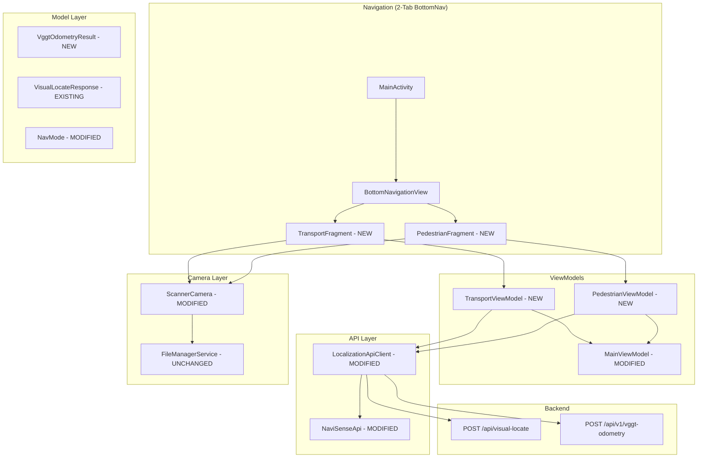
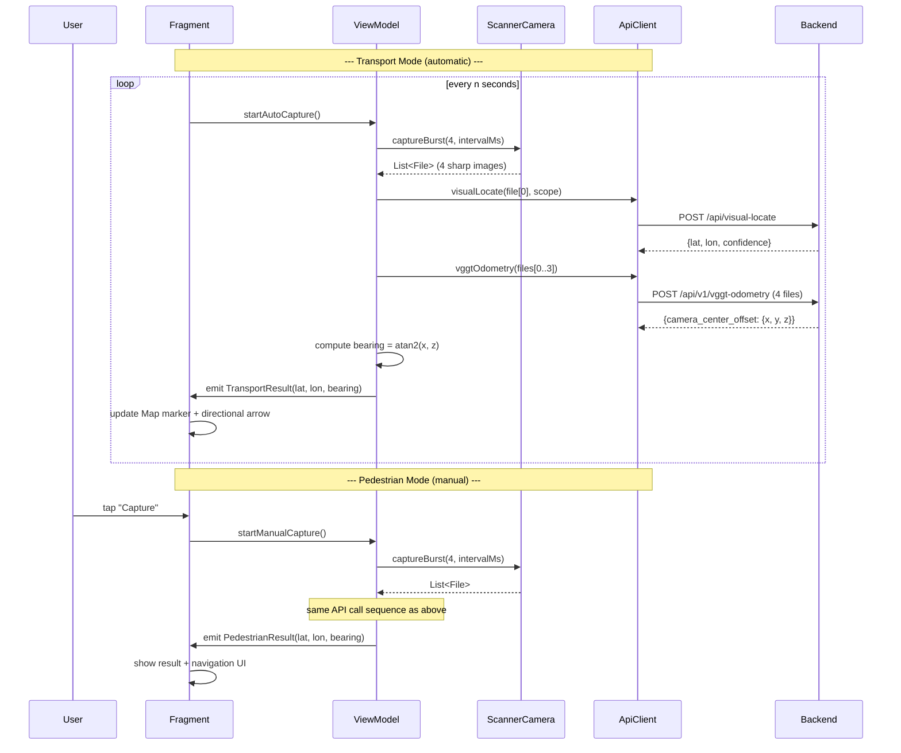
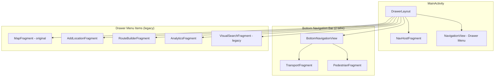

# Epic 1: "Scan & Walk" — Sensor Fusion & UI Refactoring Plan

## 1. Architecture Overview

### 1.1 High-Level Component Diagram



### 1.2 Data Flow for a Single "Scan" Cycle



---

## 2. File-by-File Implementation Plan

### PHASE 1 — API Layer (Backend Contract)

#### 1. [`mobile/android/app/src/main/java/com/navisense/core/NaviSenseApi.kt`](mobile/android/app/src/main/java/com/navisense/core/NaviSenseApi.kt)

**What to add:**
- New data class `CameraOffset(x: Double, y: Double, z: Double)`
- New data class `VggtOdometryResponse(status: String, camera_center_offset: CameraOffset)`
- New Retrofit method:

```kotlin
@Multipart
@POST("api/v1/vggt-odometry")
suspend fun vggtOdometry(
    @Part files: List<MultipartBody.Part>
): Response<VggtOdometryResponse>
```

**Key detail:** The backend field name is `files` (not `image`), matching the existing backend endpoint signature `files: List[FixedUploadFile] = File(...)`. Each `MultipartBody.Part` must use `createFormData("files", ...)`.

#### 2. [`mobile/android/app/src/main/java/com/navisense/core/LocalizationApiClient.kt`](mobile/android/app/src/main/java/com/navisense/core/LocalizationApiClient.kt)

**What to add:**
- New method `suspend fun vggtOdometry(files: List<File>): VggtOdometryResponse`
- Same retry logic (exponential backoff, 3 retries) as existing `visualLocate()`
- Create `List<MultipartBody.Part>` from files using `fileManagerService.prepareImagePart()` but with form field name `"files"` (see note below)

**Critical implementation detail:** `FileManagerService.prepareImagePart()` currently creates parts with `createFormData("image", ...)`. The VGGT endpoint expects `createFormData("files", ...)`. Options:
- **A)** Add a `fieldName` parameter to `prepareImagePart()` (preferred, minimal change)
- **B)** Create a separate `prepareVggtImagePart()` method
- **C)** Manually create parts in the client

**Recommendation:** Option A — add optional `fieldName: String = "image"` parameter to `FileManagerService.prepareImagePart()`.

#### 3. [`mobile/android/app/src/main/java/com/navisense/core/FileManagerService.kt`](mobile/android/app/src/main/java/com/navisense/core/FileManagerService.kt)

**What to modify:**
- Line 78: Change `MultipartBody.Part.createFormData("image", file.name, requestFile)` to accept a configurable field name:
  ```kotlin
  fun prepareImagePart(file: File, fieldName: String = "image"): MultipartBody.Part
  ```

---

### PHASE 2 — Model Layer

#### 4. [`mobile/android/app/src/main/java/com/navisense/model/NavMode.kt`](mobile/android/app/src/main/java/com/navisense/model/NavMode.kt)

**No change needed.** The existing `SCANNER` and `DASHCAM` values map cleanly to:
- `SCANNER` → **Pedestrian** (manual, on-demand single-shot)
- `DASHCAM` → **Transport** (automatic, continuous)

The **tab selection** (Transport vs Pedestrian) is a separate concern from the **operational mode** (Scanner vs Dashcam). The `NavMode` remains for internal operational state; the 2-tab Bottom Nav drives which screen is shown.

#### 5. **New file:** `mobile/android/app/src/main/java/com/navisense/model/VggtOdometryResult.kt`

```kotlin
package com.navisense.model

/**
 * Result from the VGGT-1B visual odometry endpoint.
 *
 * [cameraCenterOffset] is the 3D metric translation vector [x, y, z]
 * representing the relative camera-centre movement from the first
 * to the last frame in the sequence.
 *
 * [bearingDegrees] is computed as `atan2(x, z)` converted to degrees,
 * representing the heading direction (0° = forward along z-axis).
 */
data class VggtOdometryResult(
    val cameraCenterOffset: CameraOffset,
    val bearingDegrees: Double
)

data class CameraOffset(
    val x: Double,
    val y: Double,
    val z: Double
) {
    /**
     * Bearing (heading) in degrees, normalized to [0, 360).
     *
     * ## Mathematical Derivation
     *
     * The VGGT-1B model operates in a right-handed camera coordinate
     * system where:
     *   - **+Z** = forward (direction the camera is pointing)
     *   - **+X** = right (perpendicular to the viewing direction)
     *   - **+Y** = up (gravity-aligned)
     *
     * The returned [cameraCenterOffset] = [x, y, z] represents the
     * **displacement** of the camera center from frame 1 to frame N.
     *
     * To compute the **bearing** (heading on the ground plane, i.e.
     * the XY projection of movement direction), we take:
     *
     * ```
     * θ = atan2(x, z)
     * ```
     *
     * Where:
     *   - `atan2` is the 2-argument arctangent (returns [-π, π])
     *   - `x` = lateral displacement (positive = rightward movement)
     *   - `z` = forward displacement (positive = forward movement)
     *
     * If the person/car moved forward-and-right, x > 0 and z > 0,
     * so θ is small positive (e.g. +15° = bearing 15° right of centre).
     *
     * If the person/car moved backward, z < 0 so θ is ~180°,
     * indicating a U-turn.
     *
     * @return bearing in degrees, normalized to [0, 360)
     */
    fun toBearingDegrees(): Double {
        val radians = kotlin.math.atan2(x, z)
        val degrees = Math.toDegrees(radians)
        return (degrees + 360.0) % 360.0
    }
}
```

---

### PHASE 3 — ScannerCamera Enhancement

#### 6. [`mobile/android/app/src/main/java/com/navisense/core/ScannerCamera.kt`](mobile/android/app/src/main/java/com/navisense/core/ScannerCamera.kt)

**What to add — Burst Capture Mode:**

Add a new method:

```kotlin
/**
 * Captures [count] sharp images in sequence with [intervalMs] milliseconds
 * between each capture. Each image is validated for blur; blurry images
 * are skipped and the capture is retried (up to [maxRetriesPerShot] times).
 *
 * @param count        Number of sharp images to capture (default: 4).
 * @param intervalMs   Delay in ms between successive captures (default: 500ms).
 * @param onProgress   Callback invoked on main thread after each successful
 *                     capture, providing the file and current index (0-based).
 * @param onComplete   Callback invoked on main thread with all captured files.
 * @param onError      Callback invoked on main thread on fatal error.
 */
fun captureBurst(
    count: Int = 4,
    intervalMs: Long = 500L,
    maxRetriesPerShot: Int = 3,
    onProgress: (File, Int) -> Unit,
    onComplete: (List<File>) -> Unit,
    onError: (Exception) -> Unit
)
```

**Implementation strategy:**
1. Recursive coroutine-based approach using a `viewModelScope` or a dedicated `Job`.
2. Inside each iteration:
   - Call the existing `imageCapture.takePicture()` 
   - Validate sharpness via existing `isImageBlurry()`
   - If blurry → retry up to `maxRetriesPerShot`
   - If sharp → save via `fileManagerService.saveImage()`
   - Emit `onProgress(file, index)`
   - Delay `intervalMs`
3. When `count` files collected → call `onComplete(files)`
4. On unrecoverable error → call `onError()`

**Important:** Use `kotlinx.coroutines.suspendCancellableCoroutine` to bridge CameraX callback-based API into suspend functions, or keep a callback-based approach for simplicity.

**What to modify — Constructor:**
- No changes needed to the constructor signature — burst mode is an additional method.

---

### PHASE 4 — ViewModel Layer

#### 7. **New file:** `mobile/android/app/src/main/java/com/navisense/ui/transport/TransportViewModel.kt`

```kotlin
package com.navisense.ui.transport

/**
 * ViewModel for the "Транспорт" (Transport) page.
 *
 * ## Responsibilities:
 * 1. Periodic auto-capture: every [captureIntervalSeconds], captures 4 images
 *    using [ScannerCamera.captureBurst()].
 * 2. Sends the 1st image to [LocalizationApiClient.visualLocate()] for the
 *    ViT-based coordinate estimate.
 * 3. Sends all 4 images to [LocalizationApiClient.vggtOdometry()] for the
 *    VGGT-based relative odometry offset.
 * 4. Computes bearing from the VGGT offset via [CameraOffset.toBearingDegrees()].
 * 5. Emits [TransportUiState] via StateFlow for the fragment to consume.
 * 6. Integrates a "Mock / Demo" mode that bypasses the camera and sends
 *    pre-recorded static payloads.
 */
class TransportViewModel(application: Application) : AndroidViewModel(application) {

    // ── Exposed State ──────────────────────────────────────────────
    data class TransportUiState(
        val isCapturing: Boolean = false,
        val lastVisualLocation: VisualLocateResult? = null,
        val lastOdometryResult: VggtOdometryResult? = null,
        val latestBearingDegrees: Double? = null,
        val errorMessage: String? = null,
        val isMockMode: Boolean = false,
        val mockDataAvailable: Boolean = true  // true when mock payloads are loaded
    )

    private val _uiState = MutableStateFlow(TransportUiState())
    val uiState: StateFlow<TransportUiState> = _uiState.asStateFlow()

    // ── Public API ─────────────────────────────────────────────────
    fun startAutoCapture() { /* launches periodic coroutine */ }
    fun stopAutoCapture() { /* cancels periodic coroutine */ }
    fun toggleMockMode() { /* switches between live camera and mock data */ }
    fun triggerSingleScan() { /* one manual scan cycle (for testing) */ }
}
```

**Mock/Demo implementation:**
- Pre-load 4 static JPEG byte arrays from `res/raw/` (or assets) representing pre-recorded "Khreshchatyk" images
- When mock mode is active, `captureBurst()` is replaced with `loadMockBurst()` which returns these static files
- The same API calls (`visualLocate`, `vggtOdometry`) are made with these static files
- The fragment shows a prominent "MOCK DATA" badge when in this mode

#### 8. **New file:** `mobile/android/app/src/main/java/com/navisense/ui/pedestrian/PedestrianViewModel.kt`

```kotlin
package com.navisense.ui.pedestrian

/**
 * ViewModel for the "Пішоход" (Pedestrian) page.
 *
 * ## Responsibilities:
 * 1. Manual trigger: user taps a button → waits [initialDelayMs] seconds →
 *    captures 4 images with [captureIntervalMs] between shots.
 * 2. Same API pipeline as [TransportViewModel]: ViT locate + VGGT odometry.
 * 3. Computes bearing from VGGT offset.
 * 4. Mock/Demo mode identical to Transport.
 */
class PedestrianViewModel(application: Application) : AndroidViewModel(application) {

    data class PedestrianUiState(
        val isIdle: Boolean = true,
        val isWaiting: Boolean = false,      // "Live photo" countdown
        val isCapturing: Boolean = false,    // actively capturing burst
        val captureProgress: Int = 0,        // 0..4, index of current capture
        val isAnalyzing: Boolean = false,    // sending to backend
        val result: Pair<VisualLocateResult, VggtOdometryResult>? = null,
        val errorMessage: String? = null,
        val isMockMode: Boolean = false
    )

    private val _uiState = MutableStateFlow(PedestrianUiState())
    val uiState: StateFlow<PedestrianUiState> = _uiState.asStateFlow()

    fun triggerScan() { /* starts the scan sequence */ }
    fun toggleMockMode() { /* switches mock mode */ }
    fun resetState() { /* returns to IDLE */ }
}
```

#### 9. [`mobile/android/app/src/main/java/com/navisense/ui/MainViewModel.kt`](mobile/android/app/src/main/java/com/navisense/ui/MainViewModel.kt)

**What to add:**
- New `StateFlow` for the **directional arrow data** consumed by the Map in Transport mode:
  ```kotlin
  private val _directionalArrow = MutableStateFlow<DirectionalArrowData?>(null)
  val directionalArrow: StateFlow<DirectionalArrowData?> = _directionalArrow.asStateFlow()
  ```
- New data class:
  ```kotlin
  data class DirectionalArrowData(
      val latitude: Double,
      val longitude: Double,
      val bearingDegrees: Double  // for arrow rotation
  )
  ```
- New method `fun setDirectionalArrow(data: DirectionalArrowData)` called by `TransportViewModel`
- The existing `visualPinLocation` + `setVisualPinResult()` continue to work for the coordinate pin

**What to keep:** All existing location CRUD, filters, route builder, analytics data.

---

### PHASE 5 — UI Fragments & Layouts

#### 10. **New file:** `mobile/android/app/src/main/java/com/navisense/ui/transport/TransportFragment.kt`

**Layout:** `fragment_transport.xml`

```xml
<!-- CoordinatorLayout -->
    <!-- Google Map (full-screen, match_parent) -->
    <!-- PiP Camera Preview (small overlay, bottom-right corner) -->
    <!-- Directional Arrow marker (on map, rotated by bearing) -->
    <!-- Mock Data toggle button (prominent, top of screen) -->
    <!-- Mock Data badge (visible when mock mode is active) -->
    <!-- Status indicator: "Scanning..." / "Mock Mode" -->
```

**Fragment logic:**
```kotlin
class TransportFragment : Fragment() {
    // 1. Initialise Google Map (reuse logic from MapFragment)
    // 2. Initialise PiP Camera preview (small PreviewView overlay)
    // 3. Observe TransportViewModel.uiState
    // 4. On each scan cycle:
    //    a. Drop a visual pin marker (from ViT result)
    //    b. Draw/rotate a directional arrow marker (from VGGT bearing)
    //    c. Animate camera to follow the new position
    // 5. Mock button → toggles viewModel.toggleMockMode()
    // 6. onDestroyView → stopAutoCapture()
}
```

**PiP Camera implementation:**
- A small `PreviewView` (e.g., 160x120dp) overlaid on the map using `FrameLayout` or `CoordinatorLayout`
- Positioned at `bottom|end` with margin
- Uses the same `ScannerCamera` instance bound to this fragment's lifecycle

**Map integration:**
- Reuse the `SupportMapFragment` from the existing `MapFragment` code
- The new `TransportFragment` essentially **replaces** the old `MapFragment` for the Transport tab

#### 11. **New file:** `mobile/android/app/src/main/java/com/navisense/ui/pedestrian/PedestrianFragment.kt`

**Layout:** `fragment_pedestrian.xml`

```xml
<!-- LinearLayout (vertical) -->
    <!-- Camera Preview (full-width, weighted) -->
    <!-- Status overlay: "Live photo in 3..." countdown -->
    <!-- Capture button (large FAB, centred) -->
    <!-- Bottom controls: -->
    <!--   → Mock Data toggle (prominent) -->
    <!--   → Result preview (small map or coordinate display) -->
```

**Fragment logic:**
```kotlin
class PedestrianFragment : Fragment() {
    // 1. Initialise ScannerCamera with full PreviewView
    // 2. Observe PedestrianViewModel.uiState
    // 3. Capture button → viewModel.triggerScan()
    //    a. Show countdown: "3... 2... 1..."
    //    b. Capture 4 photos with interval
    //    c. Show progress: "Captured 2/4"
    //    d. Show "Analyzing..."
    //    e. Show result (coordinate + bearing arrow)
    // 4. Mock button → toggles mock mode
    // 5. Result display: small Google Map snippet or text coordinates
    // 6. "Reset" button to return to idle state
}
```

#### 12. **Navigation Changes**

**a) [`mobile/android/app/src/main/res/navigation/nav_graph.xml`](mobile/android/app/src/main/res/navigation/nav_graph.xml):**

Replace all 5 existing destinations with 2:
```xml
<navigation ... app:startDestination="@id/transportFragment">
    <fragment
        android:id="@+id/transportFragment"
        android:name="com.navisense.ui.transport.TransportFragment"
        android:label="@string/tab_transport" />

    <fragment
        android:id="@+id/pedestrianFragment"
        android:name="com.navisense.ui.pedestrian.PedestrianFragment"
        android:label="@string/tab_pedestrian" />
</navigation>
```

**b) [`mobile/android/app/src/main/res/menu/bottom_nav_menu.xml`](mobile/android/app/src/main/res/menu/bottom_nav_menu.xml):**

Replace 5 items with 2:
```xml
<menu>
    <item
        android:id="@+id/transportFragment"
        android:icon="@drawable/ic_car"     <!-- NEW drawable -->
        android:title="@string/tab_transport" />

    <item
        android:id="@+id/pedestrianFragment"
        android:icon="@drawable/ic_walk"    <!-- NEW drawable -->
        android:title="@string/tab_pedestrian" />
</menu>
```

**c) New drawable resources:**
- `res/drawable/ic_car.xml` — Vector drawable of a car (or use `@android:drawable/ic_menu_car` if available)
- `res/drawable/ic_walk.xml` — Vector drawable of a walking person (or use Material Icons: `ic_directions_walk`)

If Material Icons are available via dependency, use: `@drawable/ic_directions_car` and `@drawable/ic_directions_walk`. Otherwise create simple XML vector drawables.

---

### PHASE 6 — String Resources

#### 13. [`mobile/android/app/src/main/res/values/strings.xml`](mobile/android/app/src/main/res/values/strings.xml)

Add:
```xml
<string name="tab_transport">Транспорт</string>
<string name="tab_pedestrian">Пішоход</string>

<!-- Transport page -->
<string name="transport_mock_button">🎓 Demo / Mock Data (Khreshchatyk)</string>
<string name="transport_mock_active">⚡ Mock Data Mode Active</string>
<string name="transport_scanning">Сканування…</string>
<string name="transport_arrow_content_description">Напрямок руху</string>

<!-- Pedestrian page -->
<string name="pedestrian_capture_button">Зробити знімок</string>
<string name="pedestrian_countdown">Приготуйтесь… %d</string>
<string name="pedestrian_capturing">Знімок %d із %d</string>
<string name="pedestrian_analyzing">Аналіз…</string>
<string name="pedestrian_result_title">Результат</string>
<string name="pedestrian_reset">Скинути</string>
<string name="pedestrian_mock_button">🎓 Demo / Mock Data (Khreshchatyk)</string>
<string name="pedestrian_mock_active">⚡ Mock Data Mode Active</string>
```

Also add English translations in `values/strings.xml` (or a separate `values-en/strings.xml`):
```xml
<string name="tab_transport">Transport</string>
<string name="tab_pedestrian">Pedestrian</string>
<string name="transport_mock_button">🎓 Demo / Mock Data Khreshchatyk</string>
<string name="transport_mock_active">⚡ Mock Data Mode Active</string>
<string name="transport_scanning">Scanning…</string>
<string name="pedestrian_capture_button">Take Scan</string>
<string name="pedestrian_countdown">Get ready… %d</string>
<string name="pedestrian_capturing">Shot %d of %d</string>
<string name="pedestrian_analyzing">Analyzing…</string>
<string name="pedestrian_result_title">Result</string>
<string name="pedestrian_reset">Reset</string>
<string name="pedestrian_mock_button">🎓 Demo / Mock Data Khreshchatyk</string>
<string name="pedestrian_mock_active">⚡ Mock Data Mode Active</string>
```

---

## 3. Bearing Calculation — Full Mathematical Derivation

The VGGT-1B model returns a `camera_center_offset: {x, y, z}` which is a **metric 3D translation vector** in the camera's coordinate system.

### Coordinate System Convention

```
Camera coordinate system (right-handed):
    +Z  ─────────►  Forward (camera pointing direction)
    +X  ─────────►  Right (perpendicular to view direction)
    +Y  ─────────►  Up (gravity direction, perpendicular to ground plane)
```

### Bearing Formula

```
bearing_rad = atan2(x, z)

Where:
  x = lateral displacement (positive = rightward movement)
  z = forward displacement (positive = forward movement)

Examples:
  (x=0,   z=+1)  → atan2(0, 1)   = 0°    (moving straight forward)
  (x=+1,  z=0)   → atan2(1, 0)   = 90°   (moving right, sidestep)
  (x=0,   z=-1)  → atan2(0, -1)  = 180°  (moving backward, U-turn)
  (x=-1,  z=+1)  → atan2(-1, 1)  = -45° → 315°
  (x=+0.5, z=+0.866) → atan2(0.5, 0.866) ≈ 30° (moving forward-right)
```

### Kotlin Implementation

```kotlin
import kotlin.math.atan2
import kotlin.math.sqrt

/**
 * Compute the ground-plane bearing from the VGGT translation vector.
 *
 * @param offset The [CameraOffset] returned by the VGGT-1B model.
 * @return Bearing in degrees, normalized to [0, 360).
 */
fun bearingFromVggtOffset(offset: CameraOffset): Double {
    // atan2(x, z) gives heading in radians
    val radians = atan2(offset.x, offset.z)
    // Convert to degrees
    val degrees = Math.toDegrees(radians)
    // Normalize to [0, 360)
    return (degrees + 360.0) % 360.0
}

/**
 * Compute the horizontal magnitude (speed estimate on the ground plane).
 * Useful for determining arrow length or confidence.
 *
 * @return The 2D ground-plane distance in meters.
 */
fun horizontalMagnitude(offset: CameraOffset): Double {
    return sqrt(offset.x * offset.x + offset.z * offset.z)
}
```

### Usage in TransportFragment

```kotlin
// When VGGT result arrives:
val bearing = result.cameraCenterOffset.toBearingDegrees()

// Update map arrow marker
val arrowData = DirectionalArrowData(
    latitude = visualResult.latitude,
    longitude = visualResult.longitude,
    bearingDegrees = bearing
)
viewModel.setDirectionalArrow(arrowData)
```

The `DirectionalArrowData` is observed by the fragment, which rotates a `Marker` on the Google Map using `MarkerOptions.rotation(bearing)` and `MarkerOptions.flat(true)`.

---

## 4. Mock / Demo Data Strategy

### Pre-recorded Payload

Create `mobile/android/app/src/main/res/raw/` directory and add 4 pre-recorded JPEG images:
- `mock_khreshchatyk_01.jpg`
- `mock_khreshchatyk_02.jpg`
- `mock_khreshchatyk_03.jpg`
- `mock_khreshchatyk_04.jpg`

These should be actual photos taken at Khreshchatyk Street, Kyiv, from slightly different positions to simulate walking.

### Mock Flow

```kotlin
fun loadMockBurst(context: Context): List<File> {
    val files = mutableListOf<File>()
    for (i in 1..4) {
        val resId = context.resources.getIdentifier(
            "mock_khreshchatyk_%02d".format(i),
            "raw",
            context.packageName
        )
        val inputStream = context.resources.openRawResource(resId)
        val bytes = inputStream.readBytes()
        val file = File(context.filesDir, "TempScans/mock_$i.jpg")
        file.parentFile?.mkdirs()
        file.writeBytes(bytes)
        files.add(file)
    }
    return files
}
```

### UI Indicator

Both fragments should show a **visible, unmissable badge** when mock mode is active:
- E.g., a `MaterialCardView` with an orange/amber background saying "⚡ Mock Data: Khreshchatyk"
- Positioned at the top of the screen
- Cannot be accidentally dismissed (only by toggling mock mode off)

---

## 5. Updated: Hybrid Navigation Architecture (Drawer + BottomNav)

Per user feedback: the old 5 tabs remain accessible via a **Navigation Drawer**, while the 2-tab Bottom Nav is primary for the MVP.

### 5.1 Navigation Diagram



### 5.2 Activity Layout Structure

**`activity_main.xml` — Updated structure:**

```xml
<DrawerLayout>
    <!-- Main content (ConstraintLayout) -->
    <ConstraintLayout>
        <FragmentContainerView id="nav_host_fragment" />
        <BottomNavigationView id="bottom_navigation" />
    </ConstraintLayout>

    <!-- Navigation Drawer (side panel) -->
    <NavigationView
        android:id="@+id/nav_drawer"
        android:layout_gravity="start"
        app:menu="@menu/drawer_menu" />
</DrawerLayout>
```

### 5.3 New Menu: `res/menu/drawer_menu.xml`

```xml
<?xml version="1.0" encoding="utf-8"?>
<menu xmlns:android="http://schemas.android.com/apk/res/android">
    <item
        android:id="@+id/nav_map_legacy"
        android:icon="@drawable/ic_map"
        android:title="@string/tab_map" />
    <item
        android:id="@+id/nav_routes"
        android:icon="@drawable/ic_route"
        android:title="@string/tab_routes" />
    <item
        android:id="@+id/nav_add_location"
        android:icon="@drawable/ic_add"
        android:title="@string/tab_add" />
    <item
        android:id="@+id/nav_analytics"
        android:icon="@drawable/ic_analytics"
        android:title="@string/tab_analytics" />
    <item
        android:id="@+id/nav_visual_search_legacy"
        android:icon="@drawable/ic_search_photo"
        android:title="@string/tab_visual_search" />
</menu>
```

### 5.4 Bottom Nav Hides Bottom Nav When Drawer Opens

```kotlin
// In MainActivity:
binding.navDrawer.addDrawerListener(object : DrawerLayout.DrawerListener {
    override fun onDrawerSlide(drawerView: View, slideOffset: Float) {
        // Fade out bottom nav as drawer opens
        binding.bottomNavigation.alpha = 1f - slideOffset
    }
    override fun onDrawerOpened(drawerView: View) {
        binding.bottomNavigation.visibility = View.INVISIBLE
    }
    override fun onDrawerClosed(drawerView: View) {
        binding.bottomNavigation.visibility = View.VISIBLE
        binding.bottomNavigation.alpha = 1f
    }
})
```

### 5.5 Nav Graph: All 7 Destinations

The `nav_graph.xml` now needs to contain **all** destinations (2 new + 5 legacy):

```xml
<navigation app:startDestination="@id/transportFragment">
    <!-- NEW: Transport -->
    <fragment android:id="@+id/transportFragment"
        android:name="com.navisense.ui.transport.TransportFragment" />

    <!-- NEW: Pedestrian -->
    <fragment android:id="@+id/pedestrianFragment"
        android:name="com.navisense.ui.pedestrian.PedestrianFragment" />

    <!-- LEGACY (accessible via Drawer) -->
    <fragment android:id="@+id/mapFragment"
        android:name="com.navisense.ui.map.MapFragment" />
    <fragment android:id="@+id/addLocationFragment"
        android:name="com.navisense.ui.add.AddLocationFragment" />
    <fragment android:id="@+id/routeBuilderFragment"
        android:name="com.navisense.ui.route.RouteBuilderFragment" />
    <fragment android:id="@+id/analyticsFragment"
        android:name="com.navisense.ui.analytics.AnalyticsFragment" />
    <fragment android:id="@+id/visualSearchFragment"
        android:name="com.navisense.ui.search.VisualSearchFragment" />
</navigation>
```

### 5.6 Drawer Item Click → Navigate

```kotlin
// In MainActivity:
binding.navDrawer.setNavigationItemSelectedListener { menuItem ->
    val destinationId = when (menuItem.itemId) {
        R.id.nav_map_legacy -> R.id.mapFragment
        R.id.nav_routes -> R.id.routeBuilderFragment
        R.id.nav_add_location -> R.id.addLocationFragment
        R.id.nav_analytics -> R.id.analyticsFragment
        R.id.nav_visual_search_legacy -> R.id.visualSearchFragment
        else -> null
    }
    if (destinationId != null) {
        navController.navigate(destinationId)
    }
    binding.navDrawer.closeDrawer(GravityCompat.START)
    true
}
```

### 5.7 Hamburger Icon on Transport/Pedestrian ActionBar

- Add a hamburger menu icon (☰) to the top-left of the `TransportFragment` and `PedestrianFragment`
- On click → opens the Navigation Drawer
- Implementation: use `ActionBarDrawerToggle` or a simple ImageButton in the fragment layout

### 5.8 File Status Summary

| File | Status |
|------|--------|
| `VisualSearchFragment.kt` | **Keep as-is** — accessible via Drawer |
| `VisualSearchViewModel.kt` | **Keep as-is** — accessible via Drawer |
| `fragment_visual_search.xml` | **Keep as-is** |
| `MapFragment.kt` | **Keep as-is** — accessible via Drawer, but also has its map logic reused in TransportFragment |
| `AnalyticsFragment.kt` | **Keep as-is** |
| `RouteBuilderFragment.kt` | **Keep as-is** |
| `AddLocationFragment.kt` | **Keep as-is** |
| **New** `TransportFragment.kt` | New file |
| **New** `TransportViewModel.kt` | New file |
| **New** `PedestrianFragment.kt` | New file |
| **New** `PedestrianViewModel.kt` | New file |
| **New** `fragment_transport.xml` | New layout |
| **New** `fragment_pedestrian.xml` | New layout |
| **New** `menu/drawer_menu.xml` | New drawer menu |
| `activity_main.xml` | **Modify** — wrap in DrawerLayout, add NavigationView |
| `bottom_nav_menu.xml` | **Modify** — replace 5 items with 2 |
| `nav_graph.xml` | **Modify** — add 2 new destinations, keep 5 legacy |
| `MainActivity.kt` | **Modify** — add DrawerListener, Drawer item selection listener |

---

## 6. Open Questions / Assumptions

1. **Does the existing Visual Search flow need to be preserved?** The plan assumes VisualSearchFragment is replaced by PedestrianFragment. If the existing scope-confirmation + single-shot flow is still needed, it becomes a sub-mode of Pedestrian.

2. **What are the exact values for `n` (Transport interval) and `m` (Pedestrian interval)?** The plan suggests `n=5s` and `m=500ms` as defaults — these should be configurable constants.

3. **Should the existing Map, Analytics, Routes, and Add tabs remain accessible?** The plan assumes a clean 2-tab replacement for MVP, with old screens accessible via a menu or removed entirely. Confirm if this is acceptable.

4. **Is the mock data directory (`res/raw/`) the right location?** The 4 mock JPEGs need to be provided. For now, the plan assumes they'll be added manually by the developer. An alternative is loading from device storage.

5. **What is the source of truth for the "Khreshchatyk" mock coordinates?** The plan assumes known coordinates: `50.4501, 30.5234` (Kyiv centre). If specific Khreshchatyk coordinates are needed, they should be provided.

---

## 7. Execution Order Summary

| Step | File(s) | Description |
|------|---------|-------------|
| 1 | `NaviSenseApi.kt` | Add `VggtOdometryResponse`, `CameraOffset`, `vggtOdometry()` Retrofit method |
| 2 | `FileManagerService.kt` | Add `fieldName` parameter to `prepareImagePart()` |
| 3 | `LocalizationApiClient.kt` | Add `vggtOdometry()` method with retry logic |
| 4 | `model/VggtOdometryResult.kt` | New file: data model + bearing computation |
| 5 | `ScannerCamera.kt` | Add `captureBurst()` method |
| 6 | `ui/transport/TransportViewModel.kt` | New file: auto-capture + API orchestration |
| 7 | `ui/pedestrian/PedestrianViewModel.kt` | New file: manual capture + API orchestration |
| 8 | `MainViewModel.kt` | Add `DirectionalArrowData` flow |
| 9 | `res/raw/mock_*.jpg` | Add 4 pre-recorded mock images |
| 10 | `fragment_transport.xml` | New layout: Map + PiP camera + controls |
| 11 | `fragment_pedestrian.xml` | New layout: Camera + countdown + controls |
| 12 | `TransportFragment.kt` | New file: map + PiP + auto-capture UI |
| 13 | `PedestrianFragment.kt` | New file: manual capture + countdown UI |
| 14 | `nav_graph.xml` | Replace 5 destinations with 2 |
| 15 | `bottom_nav_menu.xml` | Replace 5 items with 2 |
| 16 | `ic_car.xml`, `ic_walk.xml` | New drawable vector icons |
| 17 | `strings.xml` | Add all new string resources (UK + EN) |
| 18 | `VisualSearchFragment.kt` | Remove or comment out from nav |
| 19 | `VisualSearchViewModel.kt` | Remove or keep as reference |
